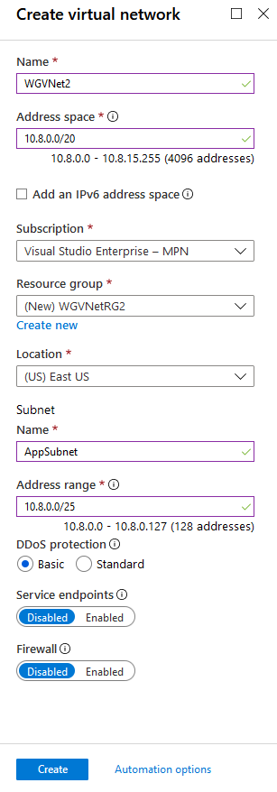
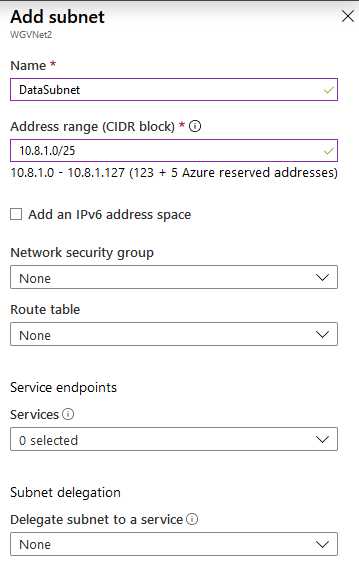
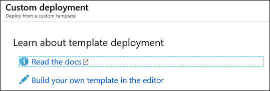
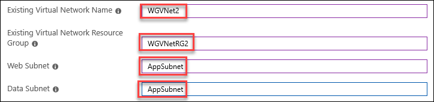
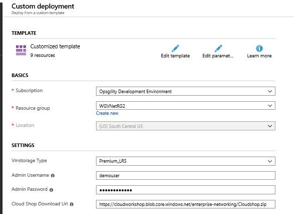



<div class="MCWHeader1">
Enterprise-class networking in Azure
</div>

<div class="MCWHeader2">
Before the hands-on lab setup guide
</div>

<div class="MCWHeader3">
March 2020
</div>

Information in this document, including URL and other Internet Web site references, is subject to change without notice. Unless otherwise noted, the example companies, organizations, products, domain names, e-mail addresses, logos, people, places, and events depicted herein are fictitious, and no association with any real company, organization, product, domain name, e-mail address, logo, person, place or event is intended or should be inferred. Complying with all applicable copyright laws is the responsibility of the user. Without limiting the rights under copyright, no part of this document may be reproduced, stored in or introduced into a retrieval system, or transmitted in any form or by any means (electronic, mechanical, photocopying, recording, or otherwise), or for any purpose, without the express written permission of Microsoft Corporation.

Microsoft may have patents, patent applications, trademarks, copyrights, or other intellectual property rights covering subject matter in this document. Except as expressly provided in any written license agreement from Microsoft, the furnishing of this document does not give you any license to these patents, trademarks, copyrights, or other intellectual property.

The names of manufacturers, products, or URLs are provided for informational purposes only and Microsoft makes no representations and warranties, either expressed, implied, or statutory, regarding these manufacturers or the use of the products with any Microsoft technologies. The inclusion of a manufacturer or product does not imply endorsement of Microsoft of the manufacturer or product. Links may be provided to third party sites. Such sites are not under the control of Microsoft and Microsoft is not responsible for the contents of any linked site or any link contained in a linked site, or any changes or updates to such sites. Microsoft is not responsible for webcasting or any other form of transmission received from any linked site. Microsoft is providing these links to you only as a convenience, and the inclusion of any link does not imply endorsement of Microsoft of the site or the products contained therein.

© 2020 Microsoft Corporation. All rights reserved.

Microsoft and the trademarks listed at <https://www.microsoft.com/en-us/legal/intellectualproperty/Trademarks/Usage/General.aspx> are trademarks of the Microsoft group of companies. All other trademarks are property of their respective owners.

**Contents**

<!-- TOC -->

- [Enterprise-class networking in Azure before the hands-on lab setup guide](#enterprise-class-networking-in-azure-before-the-hands-on-lab-setup-guide)
    - [Requirements](#requirements)
    - [Before the hands-on lab](#before-the-hands-on-lab)
        - [Task 1: Create a virtual machine to execute the lab in](#task-1-create-a-virtual-machine-to-execute-the-lab-in)
        - [Task 2: Download hands-on lab step-by-step support files](#task-2-download-hands-on-lab-step-by-step-support-files)
        - [Task 3: Create a Virtual Network (hub) with Subnets](#task-3-create-a-virtual-network-hub-with-subnets)
        - [Task 4: Use the Azure portal for a template deployment](#task-4-use-the-azure-portal-for-a-template-deployment)
        - [Task 5: Validate the CloudShop application is up after the deployment](#task-5-validate-the-cloudshop-application-is-up-after-the-deployment)

<!-- /TOC -->

# Enterprise-class networking in Azure before the hands-on lab setup guide

## Requirements

You must have a working Azure subscription to carry out this hands-on lab step-by-step without a spending cap to deploy the Barracuda firewall from the Azure Marketplace.

## Before the hands-on lab

Duration: 15 minutes

If you are working on a machine that cannot run PowerShell, carry out this task. Only do this if you are not running the commands on your local machine and are provisioning a VM to perform the steps.

### Task 1: Create a virtual machine to execute the lab in

1.  Launch a browser, and navigate to <https://portal.azure.com>. Once prompted, login with your Microsoft Azure credentials. If asked, choose whether your account is an organization account or just a Microsoft Account.

2.  Select **+Create a resource**, and in the search box, type in **Visual Studio 2019 Latest**, and press enter. In the list of results, select **Visual Studio 2019 Latest**. From the drop down, select **Visual Studio 2019 Community (latest release) on Windows Server 2019 x64**. Then select **Create**.

    

3.  On the **Create a virtual machine** blade, on the **Basics** tab, set the following configuration and choose **Next : Disks**:

    -  Subscription: **If you have multiple subscriptions, choose the subscription to execute your labs in**.

    -  Resource Group: (Create new) **OPSLABRG**

    -  Virtual machine name: **LABVM**

    -  Region: **Choose the closest Azure region to you**.

    -  Availability options: **No infrastructure redundancy required**.

    -  Image: **Visual Studio 2019 Community (latest release) on Windows Server 2019 (x64)**

    -  Size: **Standard DS1 v2** or **Standard D2s v3**

    -  User name: **demouser**

    -  Password: **demo@pass123**

    -  Public inbound ports: **Allow selected ports**.

    -  Select inbound ports: **RDP (3389)**

    -  Already have a Windows license?: **No**

    >**Note**: If the Azure Subscription you are using is **NOT** a trial Azure subscription, you may want to choose the **Standard D2s v3** to have more power in this LABMV. If you are using a Trial Subscription or one that you know has a restriction on the number of cores, stick with **Standard DS1 v2**.

4.  On the **Create a virtual machine** blade, on the **Disks** tab, set the following configuration and choose **Review + create**:

    -  OS disk type: **Standard SSD**

5.  Ensure that the validation passed and select **Create**. The deployment should begin provisioning. It may take 10+ minutes for the virtual machine to complete provisioning.

    >**Note:** Please wait for the LABVM to be provisioned prior to moving to the next step.

6.  Wait for deployment status of **LABVM** to complete. Once the deployment blade displays the message **Your deployment is complete**, select **Go to resource**.

7.  On the **LABVM** blade, first select **Connect**, then select **RDP**, and then select **Download RDP file** to establish a Remote Desktop session.

    

8.  Depending on your Remote Desktop protocol client and browser configuration, you will either be prompted to open an RDP file, or you will need to download it and then open it separately to connect.

9.  Log in with the credentials specified during creation:

    a.  User: **demouser**

    b.  Password: **demo@pass123**

10. You will be presented with a Remote Desktop Connection warning because of a certificate trust issue. Choose **Yes** to continue with the connection.

    

11. When logging on for the first time, there will be a prompt asking about network discovery. Select **No**.

    

12. Notice that Server Manager opens by default. Select **Local Server**.

    

13. In the Local Server pane, ensure the **IE Enhanced Security Configuration** is set to **Off**. If that is not the case, select **On**.

    

14. Change the setting to **Off** for Administrators, and select **OK**.

    

### Task 2: Download hands-on lab step-by-step support files

1.  Within the Remote Desktop session to **LABVM**, open Internet Explorer and download the zipped hands-on lab step-by-step student files by navigating to this link:
    https://github.com/microsoft/MCW-Enterprise-class-networking/tree/master/Hands-on%20lab/labfiles/ECN-Hackathon.zip.

2.  Extract the downloaded files into the directory **C:\\ECN-Hackathon**.

    

    

### Task 3: Create a Virtual Network (hub) with Subnets

1.  From your **LABVM**, connect to the Azure portal, select **+ Create a resource**, and in the list of Marketplace categories, select **Networking** followed by selecting **Virtual Network**.

2.  On the **Create virtual network** blade, enter the following information:

    -  Name: **WGVNet2**

    -  Address space: **10.8.0.0/20**

    -  Subscription: **Choose your subscription**.

    -  Resource group: Select **Create new**, and enter the name **WGVNetRG2**.

    -  Location: **(US) South Central US**

    -  Subnet name: **AppSubnet**

    -  Subnet address range: **10.8.0.0/25**

3.  Upon completion, it should look like the following screenshot. Validate the information is correct, and choose **Create**.

    

4.  Go to the WGVNetRG2 Resource Group, and select the **WGVNet2** blade if you're not there already, and select **Subnets** under **Settings** on the left.

    

5.  In the **Subnets** blade, select **+Subnet**.

    

6.  On the **Add subnet** blade, enter the following information:

    -  Name: **DataSubnet**

    -  Address range: **10.8.1.0/25**

    -  Network security group: **None**

    -  Route table: **None**

7.  When your dialog looks like the following screenshot, select **OK** to create the subnet.

    

8. When the subnet has completed its configuration your subnet deployment will look like the following screenshot.

       

### Task 4: Use the Azure portal for a template deployment

> **Note:** If you have not downloaded the student files see this section in the before getting started section of this hands-on lab.

1.  On your LABVM, open the **C:\\ECN-Hackathon** which contains the student files for this lab.

2.  Make sure you are signed into the Azure portal at <http://portal.azure.com>.

3.  Choose **+ Create a resource**, and search for and select **template deployment**.

    

4.  On the Template deployment blade, select **Create**.

5.  On the Custom deployment blade, select **Build your own template in the editor**.

    

6.  Choose **Load file** and select the **CloudShop.json** file from your **C:\\ECN-Hackathon** directory and then select **Save**.

    

7.  Update the following parameters to reference the **WGVNet2** virtual network in the **WGVNetRG2** resource group and to the **AppSubnet** subnet.

    - Existing Virtual Network Name: **WGVNet2**
  
    - Existing Virtual Network Resource Group: **WGVNetRG2**
  
    - Web Subnet: **AppSubnet**
  
    - Data Subnet: **DataSubnet**

    

8.  Update the **Custom deployment** blade using the following inputs, agree to the terms, and choose **Purchase**. This deployment will take approximately 30-40 minutes.

    -  Resource Group: Select **WGVNetRG2** you created earlier.

    -  Location: **(US) South Central US** (The same location you used to provision resources earlier in this lab.) Select the **check box** at the bottom to agree to the terms then select the **Purchase** button to begin the deployment.

    

### Task 5: Validate the CloudShop application is up after the deployment

1.  Using the Azure portal, open the **WGVNetRG2** Resource group and review the deployment.

2.  Navigate to the **WGWEB1** blade.

3.  On the **WGWEB1** blade, first select **Connect**, then select **RDP**, and then choose **Download RDP file** to establish a Remote Desktop session.

    

4.  Depending on your Remote Desktop protocol client and browser configuration, you will either be prompted to open an RDP file, or you will need to download it and then open it separately to connect.

5.  Log in with the credentials specified during creation:

    -  User: **demouser**

    -  Password: **demo@pass123**

6.  You will be presented with a Remote Desktop Connection warning because of a certificate trust issue. Select **Yes** to continue with the connection.

    

7.  When logging on for the first time, you will have a prompt asking about network discovery. Select **No**.

    

8.  Notice that Server Manager opens by default. Choose **Local Server**.

    

9.  In the Local Server pane, ensure the **IE Enhanced Security Configuration** is set to **Off**. If that is not the case, select **On**.

    

10. If needed, change to **Off** for Administrators, and select **OK**.

    

11. You will now ensure the CloudShop application is up and running. Open Internet Explorer, and browse to both the WGWEB1 and WGWEB2 servers:

    ```http
    http://wgweb1
    ```

    ```http
    http://wgweb2
    ```

You should follow all steps provided *before* performing the Hands-on lab.
