

Enterprise-class networking in Azure

Hands-on lab step-by-step

March 2020

Information in this document, including URL and other Internet Web site references, is subject to change without notice. Unless otherwise noted, the example companies, organizations, products, domain names, e-mail addresses, logos, people, places, and events depicted herein are fictitious, and no association with any real company, organization, product, domain name, e-mail address, logo, person, place or event is intended or should be inferred. Complying with all applicable copyright laws is the responsibility of the user. Without limiting the rights under copyright, no part of this document may be reproduced, stored in or introduced into a retrieval system, or transmitted in any form or by any means (electronic, mechanical, photocopying, recording, or otherwise), or for any purpose, without the express written permission of Microsoft Corporation.

Microsoft may have patents, patent applications, trademarks, copyrights, or other intellectual property rights covering subject matter in this document. Except as expressly provided in any written license agreement from Microsoft, the furnishing of this document does not give you any license to these patents, trademarks, copyrights, or other intellectual property.

The names of manufacturers, products, or URLs are provided for informational purposes only and Microsoft makes no representations and warranties, either expressed, implied, or statutory, regarding these manufacturers or the use of the products with any Microsoft technologies. The inclusion of a manufacturer or product does not imply endorsement of Microsoft of the manufacturer or product. Links may be provided to third party sites. Such sites are not under the control of Microsoft and Microsoft is not responsible for the contents of any linked site or any link contained in a linked site, or any changes or updates to such sites. Microsoft is not responsible for webcasting or any other form of transmission received from any linked site. Microsoft is providing these links to you only as a convenience, and the inclusion of any link does not imply endorsement of Microsoft of the site or the products contained therein.

© 2020 Microsoft Corporation. All rights reserved.

Microsoft and the trademarks listed at <https://www.microsoft.com/en-us/legal/intellectualproperty/Trademarks/Usage/General.aspx> are trademarks of the Microsoft group of companies. All other trademarks are property of their respective owners

**Contents**

<!-- TOC -->

- [Enterprise-class networking in Azure hands-on lab step-by-step](#enterprise-class-networking-in-azure-hands-on-lab-step-by-step)
  - [Abstract and learning objectives](#abstract-and-learning-objectives)
  - [Overview](#overview)
  - [Solution architecture](#solution-architecture)
  - [Requirements](#requirements)
  - [Help references](#help-references)
  - [Exercise 1: Create a Virtual Network and provision subnets](#exercise-1-create-a-virtual-network-and-provision-subnets)
    - [Task 1: Create a Virtual Network](#task-1-create-a-virtual-network)
    - [Task 2: Configure subnets](#task-2-configure-subnets)
  - [Exercise 2: Create a Network Monitoring Solution](#exercise-2-create-a-network-monitoring-solution)
    - [Task 1: Create a Log Analytics Workspace](#task-1-create-a-log-analytics-workspace)
    - [Task 2: Configure Network Watcher](#task-2-configure-network-watcher)
  - [Exercise 3: Create route tables with required routes](#exercise-3-create-route-tables-with-required-routes)
    - [Task 1: Create route tables](#task-1-create-route-tables)
    - [Task 2: Add routes to each route table](#task-2-add-routes-to-each-route-table)
  - [Exercise 4: Configure n-tier application and validate functionality](#exercise-4-configure-n-tier-application-and-validate-functionality)
    - [Task 1: Create a load balancer to distribute load between the web servers](#task-1-create-a-load-balancer-to-distribute-load-between-the-web-servers)
    - [Task 2: Configure the load balancer](#task-2-configure-the-load-balancer)
  - [Exercise 5: Build the management station](#exercise-5-build-the-management-station)
    - [Task 1: Build the management VM](#task-1-build-the-management-vm)
  - [Exercise 6: Virtual Network Peering](#exercise-6-virtual-network-peering)
    - [Task 1: Configure VNet peering WGVNet1 to WGVNet2 and Vice Versa](#task-1-configure-vnet-peering-wgvnet1-to-wgvnet2-and-vice-versa)
  - [Exercise 7: Provision and configure Azure firewall solution](#exercise-7-provision-and-configure-azure-firewall-solution)
    - [Task 1: Provision the Azure firewall](#task-1-provision-the-azure-firewall)
    - [Task 2: Create Firewall Rules](#task-2-create-firewall-rules)
    - [Task 3: Associate route tables to subnets](#task-3-associate-route-tables-to-subnets)
  - [Exercise 8: Configure Site-to-Site connectivity](#exercise-8-configure-site-to-site-connectivity)
    - [Task 1: Create OnPrem Virtual Network](#task-1-create-onprem-virtual-network)
    - [Task 2: Configure gateway subnets for on premise Virtual Network](#task-2-configure-gateway-subnets-for-on-premise-virtual-network)
    - [Task 3: Create the first gateway](#task-3-create-the-first-gateway)
    - [Task 4: Create the second gateway](#task-4-create-the-second-gateway)
    - [Task 5: Connect the gateways](#task-5-connect-the-gateways)
  - [Exercise 9: Configure Network Security Groups and Application Security Groups](#exercise-9-configure-network-security-groups-and-application-security-groups)
    - [Task 1: Create application security groups](#task-1-create-application-security-groups)
    - [Task 2: Configure application security groups](#task-2-configure-application-security-groups)
    - [Task 3: Create network security group](#task-3-create-network-security-group)
  - [Exercise 10: Validate connectivity from 'on-premises' to Azure](#exercise-10-validate-connectivity-from-on-premises-to-azure)
    - [Task 1: Create a virtual machine to validate connectivity](#task-1-create-a-virtual-machine-to-validate-connectivity)
    - [Task 2: Configure routing for simulated 'on-premises' to Azure traffic](#task-2-configure-routing-for-simulated-on-premises-to-azure-traffic)
  - [Exercise 11: Using Network Watcher to Test and Validate Connectivity](#exercise-11-using-network-watcher-to-test-and-validate-connectivity)
    - [Task 1: Configuring the Storage Account for the NSG Flow Logs](#task-1-configuring-the-storage-account-for-the-nsg-flow-logs)
    - [Task 2: Configuring Diagnostic Logs](#task-2-configuring-diagnostic-logs)
    - [Task 3: Reviewing Network Traffic](#task-3-reviewing-network-traffic)
    - [Task 4: Network Connection Troubleshooting](#task-4-network-connection-troubleshooting)
  - [After the hands-on lab](#after-the-hands-on-lab)

<!-- /TOC -->

# Enterprise-class networking in Azure hands-on lab step-by-step

## Abstract and learning objectives

In this hands-on lab, you will setup and configure virtual networks in a secure hub-and-spoke design. You will also learn how to secure virtual networks by implementing Azure Firewall, network security groups and application security groups, as well as configure route tables on the subnets in your virtual network. Additionally, you will set up access to the virtual network via a jump box and provision a site-to-site VPN connection from another virtual network, providing emulation of hybrid connectivity from an on-premises environment.

At the end of this hands-on lab, you will be better able to configure Azure networking components.

## Overview

You have been asked by Woodgrove Financial Services to provision a proof of concept deployment that will be used by the Woodgrove team to gain familiarity with a complex Virtual Networking deployment, including all of the components that enable the solution. Specifically, the Woodgrove team will be learning:

-   How to bypass system routing to accomplish custom routing scenarios.

-   How to capitalize on load balancers to distribute load and ensure service availability.

-   How to implement Azure Firewall to control hybrid and cross-virtual network traffic flow based on policies.

-   How to implement a combination of Network Security Groups (NSGs) and Application Security Groups (ASGs) to control traffic flow within virtual networks.

-   How to monitor network traffic for proper route configuration and trouble shooting.

The result of this proof of concept will be an environment resembling this diagram:

## Solution architecture

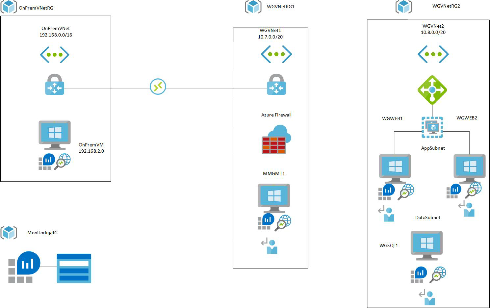

## Requirements

You must have a working Azure subscription to carry out this hands-on lab step-by-step.

## Help references

|    |            |
|----------|:-------------:|
| **Description** | **Links** |
| IP Addressing and Subnetting for New Users   | http://www.cisco.com/c/en/us/support/docs/ip/routing-information-protocol-rip/13788-3.html  |
| CIDR / VLSM Supernet Calculator  | <http://www.subnet-calculator.com/cidr.php>  |
| Virtual Network documentation  | <https://azure.microsoft.com/en-us/documentation/services/virtual-network/>  |
| Network Security Group documentation  | <https://azure.microsoft.com/en-us/documentation/articles/virtual-networks-nsg/>  |
| IP addresses in Azure      |  https://azure.microsoft.com/en-us/documentation/articles/virtual-network-ip-addresses-overview-arm/ |
| User-Defined Routing and IP Forwarding   | <https://azure.microsoft.com/en-us/documentation/articles/virtual-networks-udr-overview/>  |
| Load Balancer       | <https://azure.microsoft.com/en-us/documentation/articles/load-balancer-overview/>  |
| Implementing a DMZ between Azure and your on-premises data center    |  <https://azure.microsoft.com/en-us/documentation/articles/guidance-iaas-ra-secure-vnet-hybrid/>  |
| What is Azure Firewall?    |  <https://docs.microsoft.com/en-us/azure/firewall/overview/>  |
| Security groups    |  <https://docs.microsoft.com/en-us/azure/virtual-network/security-overview/>  |

## Exercise 1: Create a Virtual Network and provision subnets

Duration: 15 minutes

### Task 1: Create a Virtual Network

1.  From your **LABVM**, connect to the Azure portal, select **+ Create a resource**, and in the list of Marketplace categories, select **Networking** followed by selecting **Virtual Network**.

2.  On the **Create virtual network** blade, enter the following information:

    -  Name: **WGVNet1**

    -  Address space: **10.7.0.0/20**

    -  Subscription: **Select your subscription**.

    -  Resource group: Select **Create new**, and enter the name **WGVNetRG1**.

    -  Location: **(US) South Central US**

    -  Subnet name: **GatewaySubnet** (This name is fixed and cannot be changed.)

    -  Subnet address range: **10.7.0.0/29**

3.  Leave the other options as default for now.

4.  Upon completion, it should look like the following screenshot. Validate the information is correct, and select **Create**.

    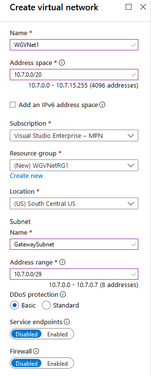

5.  Monitor the deployment status by selecting **Notifications Bell** at the top of the portal. In a minute or so, you should see a confirmation of the successful deployment. Select **Go to Resource**.

### Task 2: Configure subnets

1.  Go to the WGVNetRG1 Group, and select **WGVNet1 Virtual Network** blade if you're not there already, and select **Subnets** under **Settings** on the left.

    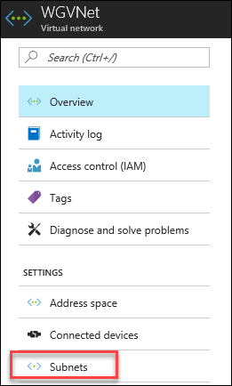

2.  In the **Subnets** blade select **+Subnet**.

    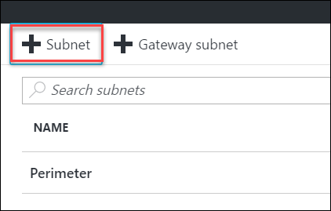

3.  On the **Add subnet** blade, enter the following information:

    -  Name: **Management**

    -  Address range: **10.7.2.0/25**

    -  Network security group: **None**

    -  Route table: **None**

    -  Service Endpoints: **Leave as Default**.

4.  When your dialog looks like the following screenshot, select **OK** to create the subnet.

    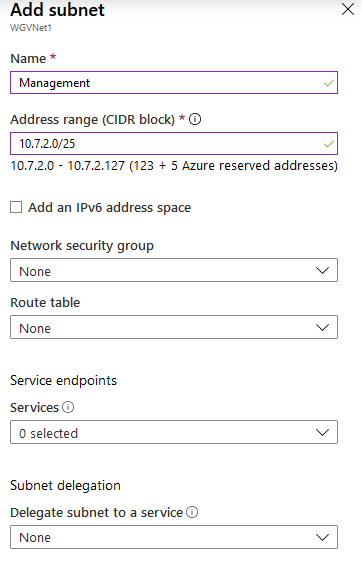

5. Repeat Step 3, enter the following information for the Azure Firewall which we will use to control traffic flow in and out of the Network. 

    -  Name: **AzureFirewallSubnet** (This name is fixed and cannot be changed.)

    -  Address range: **10.7.1.0/24**

    -  Network security group: **None**

    -  Route table: **None**

    -  Service Endpoints: **Leave as Default**

    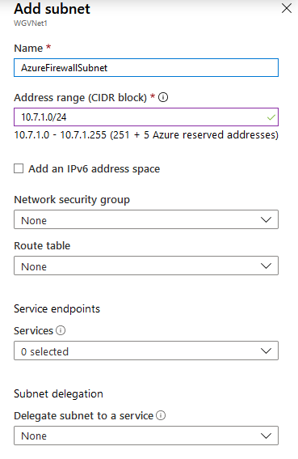

## Exercise 2: Create a Network Monitoring Solution

Duration: 15 minutes

### Task 1: Create a Log Analytics Workspace

1.  From your **LABVM**, connect to the Azure portal, select **+ Create a resource**, and in the list of Marketplace categories, select **IT & Management Tools** followed by selecting **Log Analytics**.

2.  On the **Create workspace** blade, enter the following information:

    -  Name: **Enter Unique Name all lowercase**

    -  Subscription: **Select your subscription**.

    -  Resource group: Select **Create new**, and enter the name **MonitoringRG**.

    -  Location: **East US**

    -  Pricing Tier: **Pay-as-you-go**

3.  Upon completion, it should look like the following screenshot. Validate the information is correct, and select **OK**.

    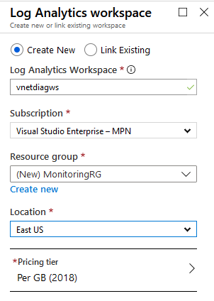

### Task 2: Configure Network Watcher

1.  From your **LABVM**, connect to the Azure portal, select **All Services**, and in the Category list, select **Networking** followed by selecting **Network Watcher**.

    

2.  In the **Overview** blade, expand your subscription and select **SouthCentralUS** by selecting the **...** button to the right then enabling the service within the region.

3.   Repeat the step above this time enabling the service within the **East US** region.

   

## Exercise 3: Create route tables with required routes

Duration: 15 minutes

Route Tables are containers for User Defined Routes (UDRs). The route table is created and associated with a subnet. UDRs allow you to direct traffic in ways other than normal system routes would. In this case, UDRs will direct outbound traffic via the Azure firewall.

### Task 1: Create route tables

1.  On the main portal menu, select **+ Create a Resource**. Type **route** into the search box, and select **Route table** then select **Create**.

2.  On the **Create a Route table** blade enter the following information:

    -  Name: **MgmtRT**

    -  Subscription: **Select your subscription**.

    -  Resource group: Select **WGVNetRG1** from the drop down.

    -  Location: **(US) South Central US**

    -  Virtual network gateway route propagation: **Enabled**

3.  When the dialog looks like the following screenshot, select **Create**.

    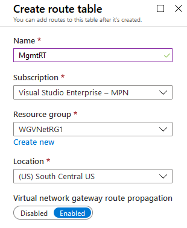

4.  Repeat steps 1 and 2 to create the **AppRT** route table:

    -  Name: **AppRT**

    -  Subscription: **Select your subscription**.

    -  Resource group: Select **WGVNetRG2** from the drop down.

    -  Location: **(US) South Central US**

    -  Virtual network gateway route propagation: **Enabled**

5.  Once route tables are created, your **Route tables** blade should look like the following screenshot:

    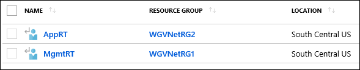

### Task 2: Add routes to each route table

1.  Select the **AppRT** route table, and select **Routes** under **Settings** on the left.

    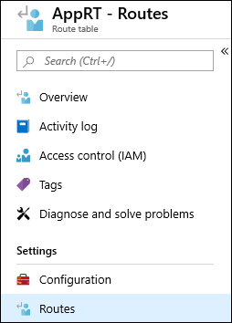

2.  On the **Routes** blade, select **+ Add**. Enter the following information, and select **OK**:

    -  Route name: **AppToInternet**

    -  Address prefix: **0.0.0.0/0**

    -  Next hop type: **Virtual appliance**

    -  Next hop address: **10.7.1.4**

    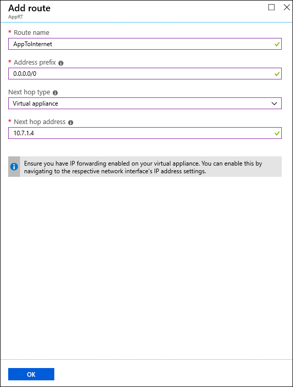

3.  Repeat this procedure to add the **AppToMgmt** route using the following information:

    -  Route name: **AppToMgmt**

    -  Address prefix: **10.7.0.8/29**

    -  Next hop type: **Virtual appliance**

    -  Next hop address: **10.7.1.4**

    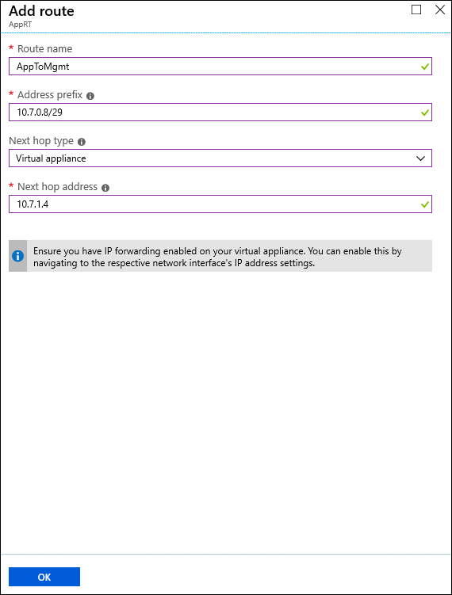

4.  Upon completion, your routes in the **AppRT** route table should look like the following screenshot:

    

5.  In the Azure Portal, go to All Services and type Route in the search box and select **Route tables**.

6.  Select **MgmtRT**, and select **Routes** under **Settings** on the left.

    

7.  On the **Routes** blade, select +**Add**. Enter the following information, and select **OK**:

    -  Route name: **MgmtToOnPremises**

    -  Address prefix: **192.168.0.0/16**

    -  Next hop type: **Virtual network gateway**

    -  Next hop address: **Leave blank**.

    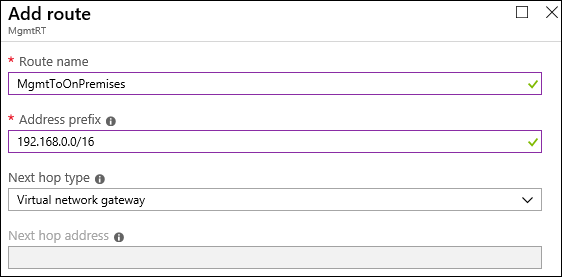

8.  Add the **MgmtToApp** route using the following information:

    -  Route name: **MgmtToApp**

    -  Address prefix: **10.7.2.0/25**

    -  Next hop type: **Virtual appliance**

    -  Next hop address: **10.7.1.4** (This is the private IP of Azure Firewall.)

    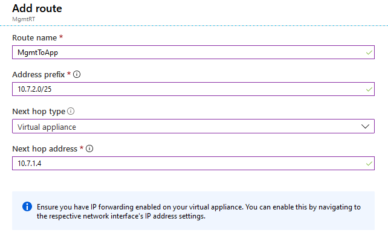

9.  Upon completion, your routes in the **MgmtRT** route table should look like the following screenshot:

    

    >**Note:** The route tables and routes you have just created are not associated with any subnets yet, so they are not impacting any traffic flow yet. This will be accomplished later in the lab.

## Exercise 4: Configure n-tier application and validate functionality

Duration: 20 minutes

In this exercise, you will create and configure a load balancer to distribute load between the web servers. 

### Task 1: Create a load balancer to distribute load between the web servers

1.  In the Azure portal, select **+ Create a resource**, then **Networking** and **Load Balancer**.

    

2.  On the **Create load balancer** blade, on the **Basics** tab, enter the following values:

    -  Subscription: **Select your subscription**.

    -  Resource group: **WGVNetRG2**

    -  Name: **WGWEBLB**

    -  Region: **(US) South Central US**

    -  Type: **Internal**

    -  SKU: **Basic**

    -  Virtual network: **WGVNet2**

    -  Subnet: **AppSubnet (10.8.0.0/25)**

    -  IP address assignment: Select **Static** and enter the IP address **10.8.0.100**.

    Ensure your **Create load balancer** dialog looks like the following, and select **Review + create** then select **Create**.

    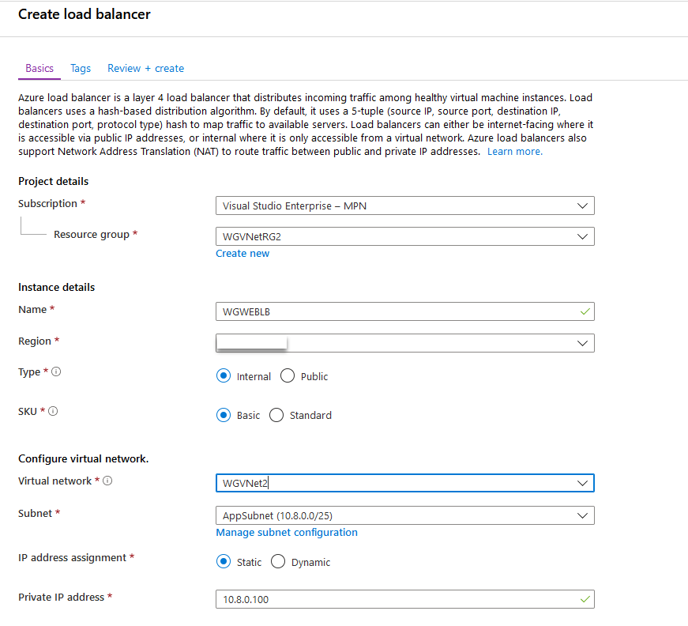

### Task 2: Configure the load balancer

1.  Open the **WGWEBLB** load balancer in the Azure portal.

2.  Select **Backend pools**, and select **+Add** at the beginning.

    

3.  Enter **LBBE** for the pool name. Under **Associated to**, select **Virtual machine**.

    

4.  Under **Virtual machine**, choose the **WGWEB1** virtual machine and private IP address, then for the second virtual machine choose the **WGWEB2** virtual machine and private IP address.

5.  Select **Add** to add the backend pool.

6.  Wait to proceed until the Backend pool configuration is finished updating.

    

7.  Next, under **Settings** on the WGWEBLB Load Balancer blade select **Health Probes**. Select **+ Add**, and use the following information to create a health probe.

    -  Name: **HTTP**

    -  Protocol: **HTTP**

    

    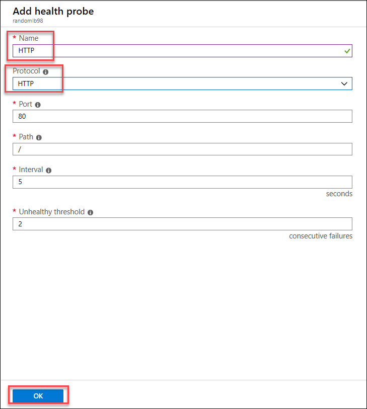

8.  Select **OK**.

9.  After the Health probe has updated. Select **Load balancing rules**. Select **+Add** and complete the configuration as shown below followed by selecting **OK**.

    - Name: **HTTP**
  
    - Leave the rest as defaults.

    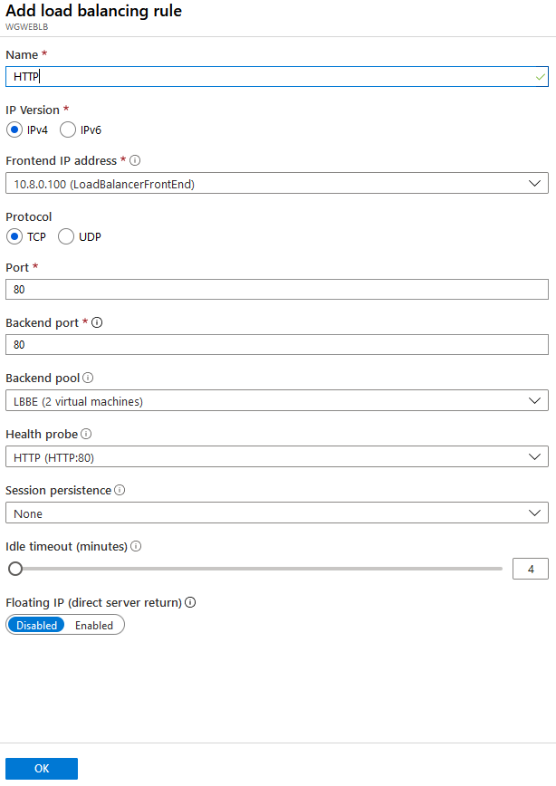

    **It will take 2-3 minutes for the changes to save.**

10. From an RDP session to WGWEB1, open your browser and navigate to <http://10.8.0.100>. Ensure that you successfully connect to either one of two Web servers. 

    

    

11. Using the portal, disassociate the public IP from the NIC of **WGWEB1** **VM**. Do this by navigating to the VM and selecting **Networking** under **Settings** on the left. Select the **NIC Public IP** then choose **Dissociate**. Select **Yes** when prompted.

    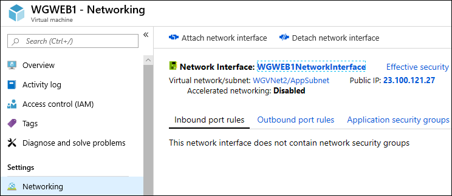

12. Next, return to the **WGWEB1 - Networking** blade and select the **Network Interface**

13. Select **IP configurations** under **Settings** on the left.

    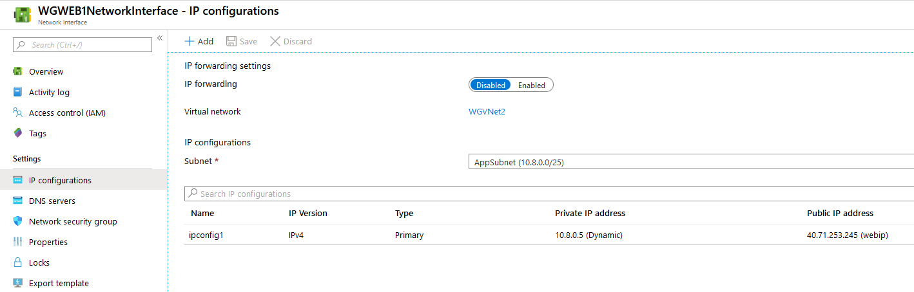

14. Next, select **ipconfig1** shown above.

15. Select and make sure that the **Public IP address settings** is shown as disabled, and select **Save** if necessary. This should remove the public IP address from the network interface of the VM.

    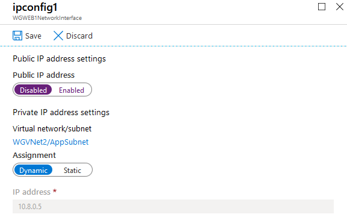

## Exercise 5: Build the management station

Duration: 15 minutes

In this exercise, management of the Azure-based systems will only be available from a management 'jump box.' In this section, you will provision this server.

### Task 1: Build the management VM

1.  In the Azure portal, select **+ Create a resource** then select **Windows Server 2016 Datacenter**.

2.  On the **Create a virtual machine** blade, on the **Basics** tab, enter the following information, and select **Next : Disks >**:

    -  Subscription: **Select your subscription**.

    -  Resource group: Select **Create new** and enter **WGMGMTRG**.

    -  Virtual machine name: **WGMGMT1**

    -  Region: **(US) South Central US**

    -  Availability options: **No infrastructure redundancy required**.

    -  Image: **[smalldisk] Windows Server 2016 Datacenter**

    -  Size: **Standard DS1 v2**

    -  Username: **demouser**

    -  Password: **demo@pass123**

    -  Public inbound ports: **Allow selected ports**.

    -  Select inbound ports: **RDP**

    -  Already have a Windows license?: **No**

3.  On the **Create a virtual machine** blade, on the **Disks** tab, set the following configuration and select **Next : Networking >**:

    -  OS disk type: **Premium SSD**

4.  On the **Create a virtual machine** blade, on the **Networking** tab, set the following configuration and select **Next : Management >**:

    -  Virtual network: **WGVNet1**

    -  Subnet: **Management (10.7.0.0/25)**

    -  Public IP: **None**

    -  NIC network security group: **None**

    -  Accelerated networking: **Off**

    -  Place this virtual machine behind an existing load balancing solution: **No**

5.  On the **Create a virtual machine** blade, on the **Management** tab, set the following configuration and select **Review + create**:

    -  Boot diagnostics: **Off**

    -  OS guest diagnostics: **Off**

    -  System assigned managed identity: **Off**

    -  Enable auto-shutdown: **Off**

6.  On the **Create a virtual machine** blade, on the **Review + Create** tab, ensure the validation passes, and select **Create**. The virtual machine will take about 5 minutes to provision.

## Exercise 6: Virtual Network Peering

Duration: 20 Minutes

### Task 1: Configure VNet peering WGVNet1 to WGVNet2 and Vice Versa

1.  Select the resource group **WGVNetRG1**, and select the configuration blade for **WGVNet1**. select **Peerings** under **Settings** on the left.

2.  Select **Add**.

    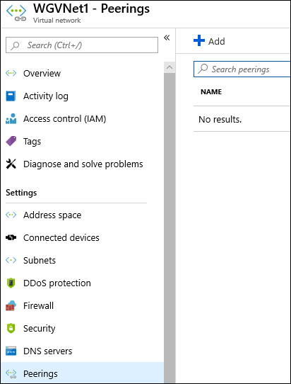

3.  Set the following configuration for the new peering. Select **OK** to create the peering.

    - Peering Name (WGVNet1 to WGVNet2): **VNETPeering_WGVNet1-WGVNet2**
  
    - Virtual Network: **WGVNet2**
  
    - Peering Name (WGVNet2 to WGVNet1): **VNETPeering_WGVNet2-WGVNet1**

    - Allow virtual network access from WGVNet1 to WGVNet2: **Enabled**
   
    - Allow virtual network access from WGVNet2 to WGVNet1: **Enabled** 

    - Allow forwarded traffic from WGVNet2 to WGVNet1: **Enabled**
  
    - Allow forwarded traffic from WGVNet1 to WGVNet2: **Enabled**

    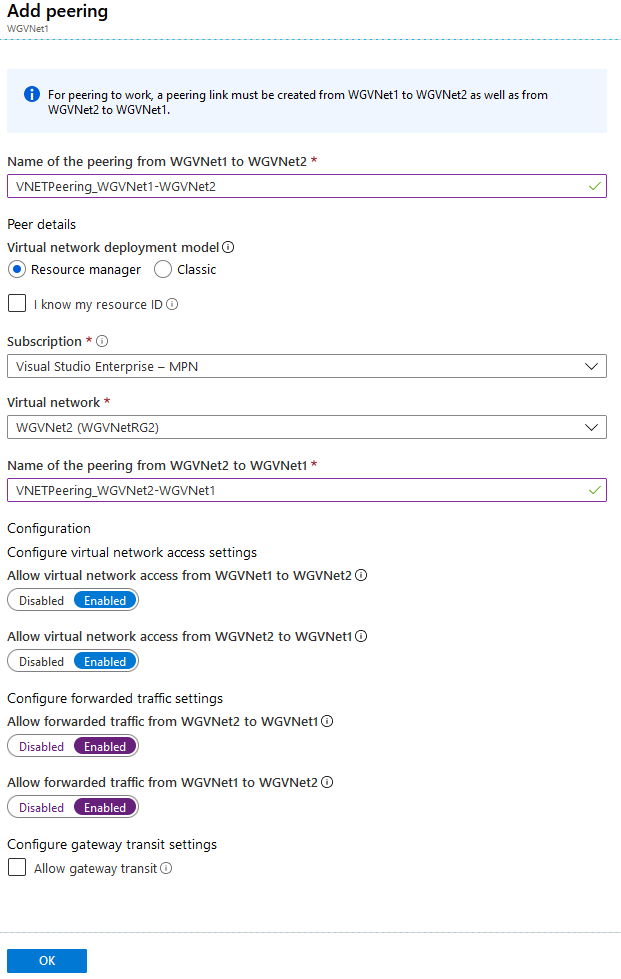

<!-- ### Task 2: Configure VNet peering WGVNET2 to WGVNET1

1.  Select the resource group **WGVNetRG2**, and select the configuration blade for **WGVNet2**. select **Peerings**.

2.  Select **Add**.

3.  Name the new peering **VNETPeering_WGVNet2-WGVNet1**, enable the **Allow forwarded traffic** and **Use remote gateways** settings, and select **OK** to create the peering.

     -->

## Exercise 7: Provision and configure Azure firewall solution

Duration: 15 minutes

In this exercise, you will provision and configure an Azure firewall in your network. 

### Task 1: Provision the Azure firewall

1.  In the Azure portal, select **+ Create a resource**. In the **Search the Marketplace** text box, type **Firewall**, in the list of results, select **Firewall**, and on the **Firewall** blade, select **Create**.

2.  On the **Create a firewall** blade, on the **Basics** tab, enter the following information: 

    -  Subscription: select your subscription.

    -  Resource group: **WGVNetRG1**

    -  Name: **azureFirewall**

    -  Region: **(US) South Central US**

    -  Select a Virtual network: Select **Use existing** and then select **WGVNet1**.

    -  Public IP address: **Create new**

    -  Public IP address name: **azureFirewall-ip**

    -  Public IP address SKU: **Standard**

3.  Select **Review + create** and then select **Create** to provision the Azure Firewall. 

    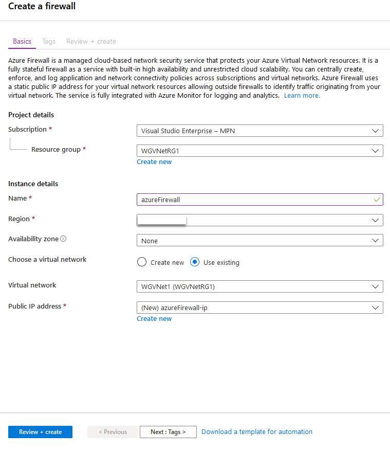

### Task 2: Create Firewall Rules

Within 1-2 minutes, the resource group **WGVNetRG1** will have the firewall created. Next, we will firewall rules to allow the inbound and outbound traffic.

1.  On the main Azure menu select **Resource groups**.

2.  Select the **WGVNetRG1** resource group. This resource group contains the azure firewall and its public IP address resources.

3.  Navigate to the **azureFirewall-ip** blade and note the value of its public IP address. You will need it later in this task.

4.  Navigate to the **azureFirewall** blade, and, on the **Overview** page, select **Rules** under **Settings** on the left.

    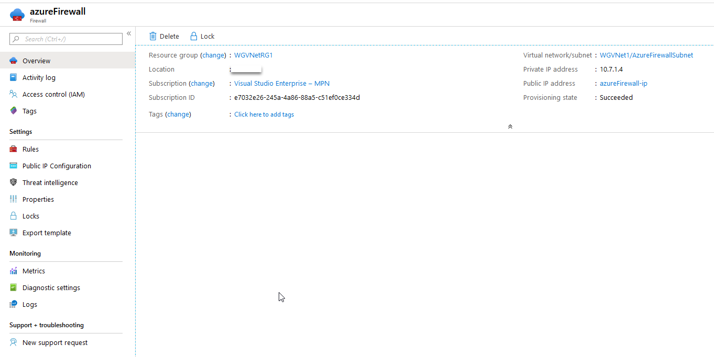

5.  Select **+ Add NAT Rule collection** and enter the following information to create an inbound NAT Rule (collection is a list of rules that share the same priority and action):

    -  Name: **NATRuleCollection1**

    -  Priority: **250**

    -  Rules Name: **IncomingHTTP**

    -  Protocol: **TCP**

    -  Source address: **\***

    -  Destination Address: Type the public IP address assigned to the firewall you identified earlier in this task.

    -  Destination ports: **80** (to allow HTTP traffic)

    -  Translated Address: **10.8.0.100** (Private IP of the Azure Load Balancer you deployed earlier in this lab.)
        
    -  Translated Port: **80**

6.  Create another rule for HTTPS, as illustrated on the following screenshot (alternatively you could create a single rule for both HTTP and HTTPS).

    - Rule Name: **IncomingHTTPS**
  
    - Protocol: **TCP**
  
    - Source Addresses: **\***
  
    - Destination Address: Type the public IP address assigned to the firewall you identified earlier in this task.
  
    - Destination ports: **443**
  
    - Translated Address: **10.8.0.100**
  
    - Translated Port: **443**

    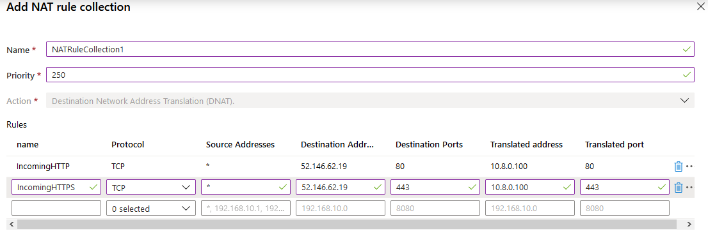

7.  Select **Add** and wait until the update completes.

8.  Back on the Azure Firewall **Rules** page, select **Network rule collection**. Then Select **+ Add Network Rule collection** and enter the following information to create a Network Rule for inbound traffic. This rule allows HTTP connectivity from any directly connected network targeting the frontend IP address of the load balancer.

    -  Name: **NetworkRuleCollectionAllow1**

    -  Priority: **100**

    -  Action: **Allow**

    -  Rule Name: **IncomingWeb**

    -  Protocol: **TCP**

    -  Source address: **\***

    -  Destination Address: **10.8.0.100**

    -  Destination ports: **80,443**

9.  Crate another rule for Remote Desktop sessions from the Management subnet on WGVNet1.

    -  Rule Name: **IncomingMgmtRDP**

    -  Protocol: **TCP**

    -  Source address: **10.7.2.0/25**

    -  Destination Address: **10.8.0.0/25**

    -  Destination ports: **3389**

    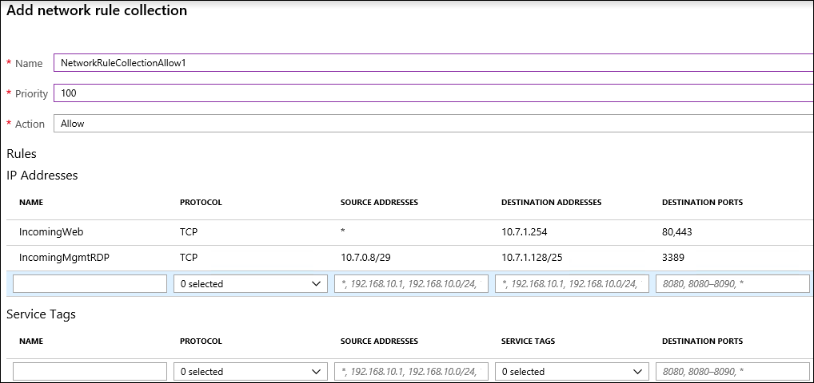

10. Select **Add** and wait until the update completes.

### Task 3: Associate route tables to subnets

1.  In the Azure portal, navigate to the blade displaying properties of the **WGVNetRG2** resource group.

2.  Select **AppRT**, followed by **Subnets** and then select **+ Associate**.

    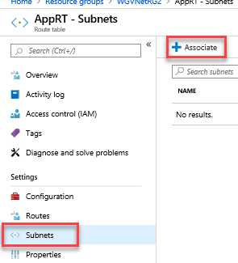

3.  On the **Associate subnet** blade, select **WGVNet2** on the **Virtual network** drop down. Select **AppSubnet** on the **Subnet** dropdown. 

    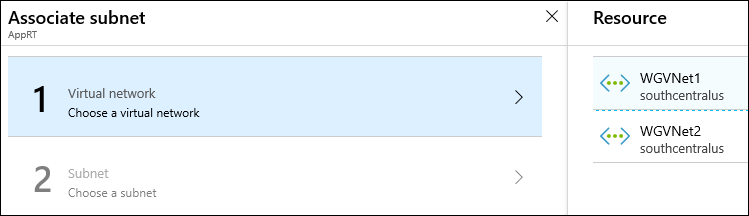

4.  Select **OK** at the bottom of the **Associate subnet** blade.

5.  Navigate to the blade displaying properties of the **WGVNetRG1** resource group, and select **MgmtRT**, then **Subnets**.

6.  Select the **+ Associate**.

7.  On the **Associate subnet** blade, select **WGVNet1** on the **Virtual network** drop down. Select **Management** on the **Subnet** dropdown. 

    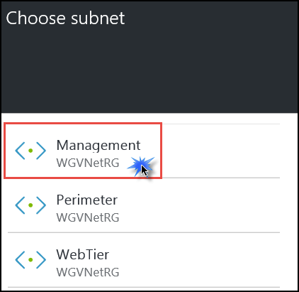

8.  Select **OK** at the bottom of the **Associate subnet** blade.

## Exercise 8: Configure Site-to-Site connectivity

Duration: 60 minutes

In this exercise, we will simulate an on-premises connection to the internal web application. To do this, we will first set up another Virtual Network in a separate Azure region followed by the Site-to-Site connection of the 2 Virtual Networks Finally, we will set up a virtual machine in the new Virtual Network to simulate on-premises connectivity to the internal load-balancer.

### Task 1: Create OnPrem Virtual Network

1.  In the Azure portal, select **+ Create a resource**, **Networking** and **Virtual network**.

2.  On the **Create virtual network** blade, enter the following information:

    -  Name: **OnPremVNet**

    -  Address space: **192.168.0.0/16**

    -  Subscription: **Select your subscription**.

    -  Resource group: Select **Create new**, and enter the name **OnPremVNetRG**.

    -  Location: **(US) East US** (Make sure this is **NOT** the same location you have specified in the previous exercises.)

    -  Subnet name: **default**

    -  Subnet address range: **192.168.0.0/24**

3.  Leave the other options with their default values.

4.  Upon completion, it should look like the following screenshot. Validate the information is correct, and select **Create**.

    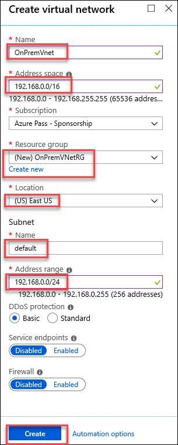

### Task 2: Configure gateway subnets for on premise Virtual Network

1.  Select the **OnPremVnetRG** Resource Group and then open the **OnPremVNet** blade and select **Subnets**.

2.  Next, select **+ Gateway subnet**.

    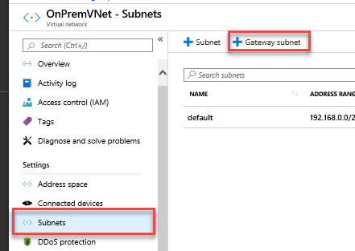

3.  Specify the following configuration for the subnet, and select **OK**:

    -  Address range: **192.168.1.0/29**

    -  Route table: **None** (We will add later.)

    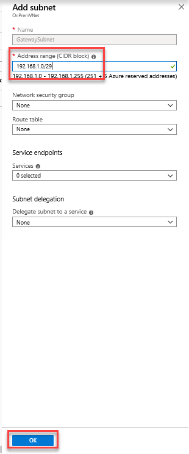

4.  Next, select **+ Subnet** and add **OnPremManagementSubnet** to the **OnPremVNet**, as shown below in the screenshot:

    - Name: **OnPremManagementSubnet**
  
    - Address range: **192.168.2.0/29**
  
    - Leave the rest of the values as their defaults. 

    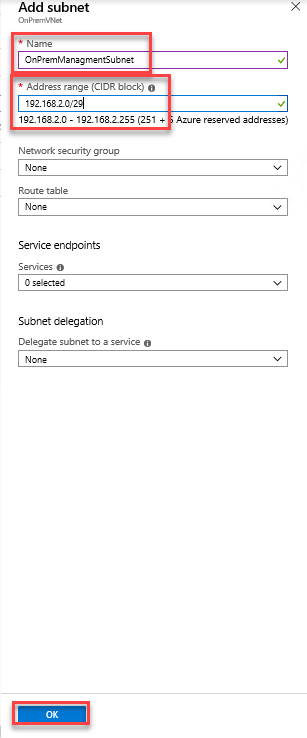

### Task 3: Create the first gateway

1.  Using the Azure Management portal, select **+ Create a resource**, type **Virtual Network gateway** in the **Search the Marketplace** text box, in the list of results, select **Virtual network gateway**, and then select **Create**.

2.  On the **Create virtual network gateway** blade,  enter the following information and select **Review + create**:

    -  Subscription: **Select your subscription**.

    -  Name: **OnPremWGGateway**

    -  Region: **(US) East US** (This must match the location in which you created the **OnPremVNet** virtual network.)

    -  Gateway type: **VPN**

    -  VPN type: **Route-based**

    -  SKU: **VpnGw1**

    -  Virtual network: **OnPremVNet**

    -  Public IP address: **Create new**

    -  Public IP address name: **onpremgatewayIP1**

    -  Enable active-active mode: **Enabled**

    -  Second Public IP address name: **onpremgatewayIP2**

    -  Configure BGP ASN: **Disabled**

    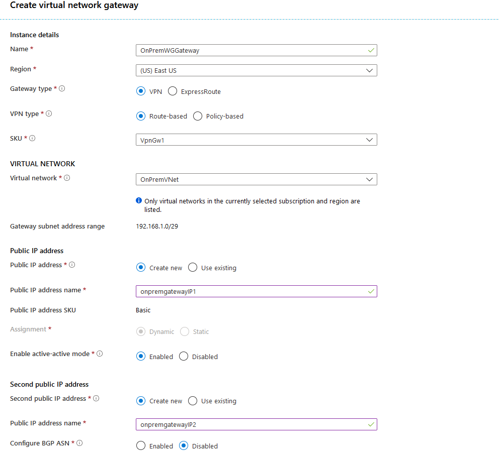

3.  Validate your settings and select **Review + Create** then **Create**.

    >**Note:** The gateway will take 30-45 minutes to provision. Rather than waiting, continue to the next task.

### Task 4: Create the second gateway

1.  Using the Azure Management portal, select **+ Create a resource**, type **Virtual Network gateway** in the **Search the Marketplace** text box, in the list of results, select **Virtual network gateway**, and then select **Create**.

2.  On the **Create virtual network gateway** blade,  enter the following information and select **Review + create**:

    -  Subscription: **Select your subscription**.

    -  Name: **WGVNet1Gateway**

    -  Region: **(US) South Central US** (This must match the location in which you created the **WGVNet1** virtual network.)

    -  Gateway type: **VPN**

    -  VPN type: **Route-based**

    -  SKU: **VpnGw1**

    -  Virtual network: **WGVNet1**

    -  Resource group: **WGVNetRG1**

    -  Public IP address: **Create new**

    -  Public IP address name: **vnet1gatewayIP1**

    -  Enable active-active mode: **Enabled**

    -  Second Public IP address name: **vnet1gatewayIP2**

    -  Configure BGP ASN: **Disabled**

    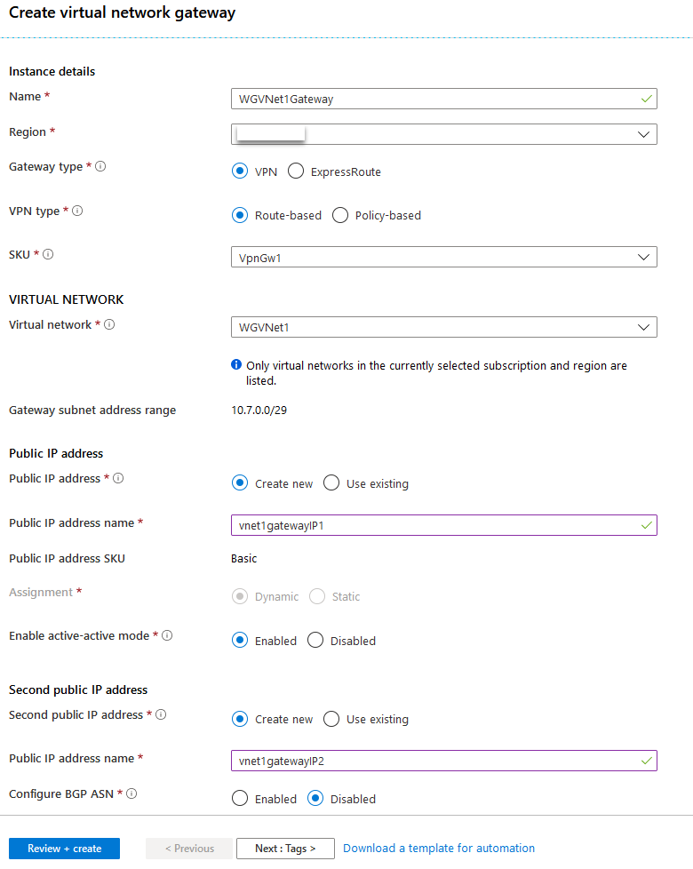

3.  Validate your settings and select **Create**.

    >**Note:** The gateway will take 30-45 minutes to provision. You will need to wait until both gateways are provisioned before proceeding to the next section.

4.  The Azure portal will display a notification when the deployments have completed.

### Task 5: Connect the gateways

1.  In the Azure portal, select **+ Create a resource**, in the **Search the Marketplace** text box, type in **Connection**, and press **Enter**.

2.  On the **Connection** blade, select **Create**.

3.  On the **Basics** blade, leave the **Connection type** set to **VNet-to-VNet**. Select the existing **WGVNetRG1** resource group. Then, change the location of this connection to the Azure region hosting the **WGVNet1** virtual network, **South Central US**. Select **OK**.

    

4.  On the Settings tab, select **WGVNet1Gateway** as the first virtual network gateway and **OnPremWGGateway** as the second virtual network gateway. Ensure **Establish bidirectional connectivity** and **IKEV2** is selected. Enter a shared key, such as **A1B2C3D4**. Select **OK**.

    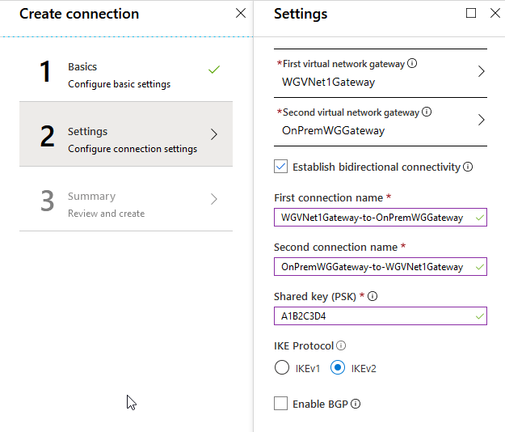

5.  Select **OK** on the **Summary** page to create the connection.

6.  In the Azure portal, select **All services**. Then, type **connections** in the search text box and select **Connections**.

    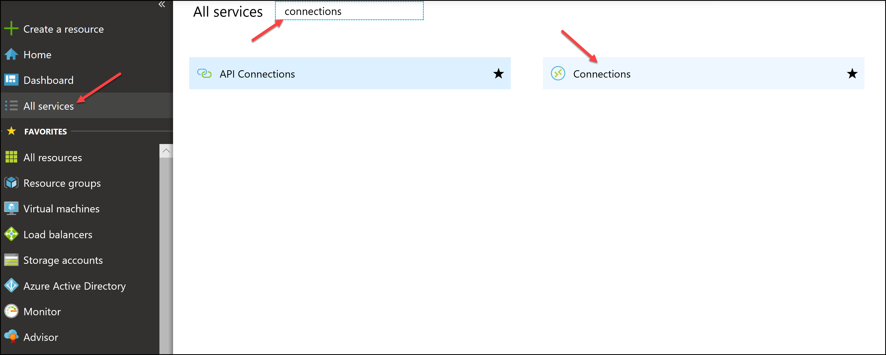

7.  Watch the progress of the connection status, and use the **Refresh** icon until the status changes for both connections from **Unknown** to **Connected**. This may take 5-10 minutes or more. You might need to refresh the page to see the change in status.

    

## Exercise 9: Configure Network Security Groups and Application Security Groups

Duration: 20 minutes

In this exercise, you will restrict traffic between tiers of n-tier application by using network security groups and application security groups.

### Task 1: Create application security groups

1.  In the Azure portal, select **+ Create a resource**. In the **Search the Marketplace**, type **Application security group** and press Enter. Next, on the **Application security group** blade, select **Create**.

2.  On the **Create an application security group** blade, on the **Basics** tab, enter the following information, and select **Review + create**:

    -  Subscription: **Select your subscription**.

    -  Resource group: **WGVNetRG2**

    -  Name: **WebTier**

    -  Region: **(US) South Central US** (This must match the location in which you created the **WGVNet2** virtual network.)

    

3.  On the **Create an application security group** blade, on the **Review + Create** tab, ensure the validation passes, and select **Create**. 

4.  Repeat the previous two steps to create an application security group named **DataTier** with the settings matching those on the following screenshot.

    -  Subscription: **Select your subscription**.

    -  Resource group: **WGVNetRG2**

    -  Name: **DataTier**

    -  Region: **(US) South Central US** (This must match the location in which you created the **WGVNet2** virtual network.)

    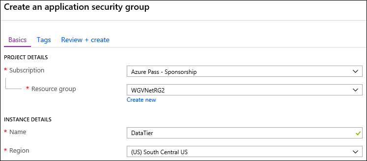

### Task 2: Configure application security groups

1.  In the Azure portal, navigate to the **Virtual machines** blade and select **WGWEB1**.

2.  On the **WGWEB1** blade, select **Networking** under **Settings** on the left.

3.  On the **WGWEB1 - Networking** blade, select **Application security groups** and then select **Configure the application security groups**.

4.  On the **Configure the application security groups** blade, in the **Application security groups** drop-down list, select **WebTier**, then **Save**.

    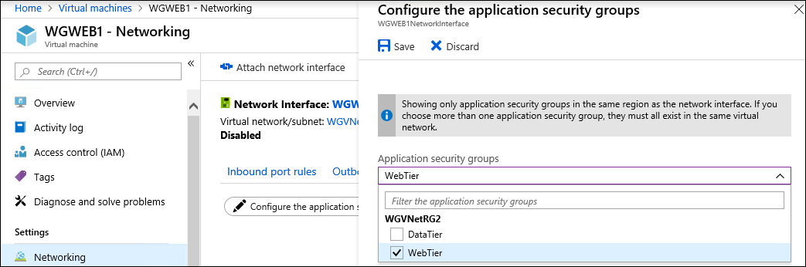

5.  Repeat steps 1-4, but this time for **WGWEB2** in order to assign to its network interface the **WebTier** application security group.

6.  Repeat steps 1-4, but this time for **WGSQL1** in order to assign to its network interface the **DataTier** application security group.

### Task 3: Create network security group

1.  In the Azure portal, select **+ Create a resource**. In the **Search the Marketplace**, type **Network security group** and press Enter. Select it and on the **Network security group** blade, select **Create**.

2.  On the **Create network security group** blade, enter the following information, and select **Review + Create** then **Create**:
   
    -  Subscription: **Select your subscription**.

    -  Resource group: **WGVNetRG2**

    -  Name: **WGAppNSG1**

    -  Region: **(US) South Central US** (This must match the location in which you created the **WGVNet2** virtual network.)

    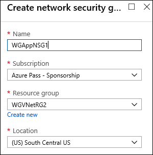

3.  In the Azure Portal, navigate to **All Services**, type **Network security groups** the search box and select **Network security groups**.

4.  On the **Network security groups** blade, select **WGAppNSG1**. 

5.  On the **WGAppNSG1** blade, select **Inbound security rules** under **Settings** on the left and select **Add**.

6.  On the **Add inbound security rule** blade, enter the following information, and select **Add**:

    -  Source: **Application security group**

    -  Source application security group: **WebTier**

    -  Source port ranges: **\***

    -  Destination: **Application security group**

    -  Destination application security group: **DataTier**

    -  Destination port ranges: **1433**

    -  Protocol: **TCP**

    -  Action: **Allow**

    -  Priority: **100**

    -  Name: **AllowDataTierInboundTCP1433**

    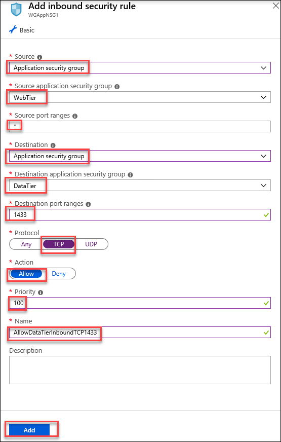

7.  On the **WGAppNSG1 - Inbound security rules** blade, select **Add**.

8.  On the **Add inbound security rule** blade, enter the following information, and select **Add**:

    -  Source: **Any**

    -  Source port ranges: **\***

    -  Destination: **Application security group**

    -  Destination application security group: **WebTier**

    -  Destination port ranges: **80**

    -  Protocol: **TCP**

    -  Action: **Allow**

    -  Priority: **150**

    -  Name: **AllowAnyWebTierInboundTCP80**

    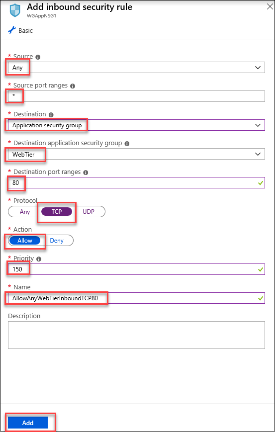

9.  On the **WGAppNSG1 - Inbound security rules** blade, select **Add**.

10. On the **Add inbound security rule** blade, enter the following information, and select **Add**:

    -  Source: **IP Addresses**

    -  Source IP addresses/CIDR ranges: **10.7.2.0/25** (This IP address range represents the Management subnet on WGVNet1.)

    -  Source port ranges: **\***

    -  Destination: **Any**

    -  Destination port ranges: **3389**

    -  Protocol: **Any**

    -  Action: **Allow**

    -  Priority: **200**

    -  Name: **AllowMgmtInboundAny3389**

    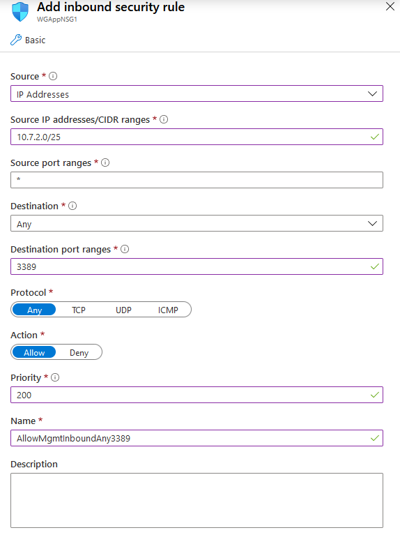

11. On the **WGAppNSG1 - Inbound security rules** blade, select **Add**.

12. On the **Add inbound security rule** blade, enter the following information, and select **Add**:

    -  Source: **Service Tag**

    -  Source service tag: **VirtualNetwork**

    -  Source port ranges: **\***

    -  Destination: **Application security group**

    -  Destination application security group: **DataTier**

    -  Destination port ranges: **\***

    -  Protocol: **Any**

    -  Action: **Deny**

    -  Priority: **1000**

    -  Name: **DenyVNetDataTierInbound**

    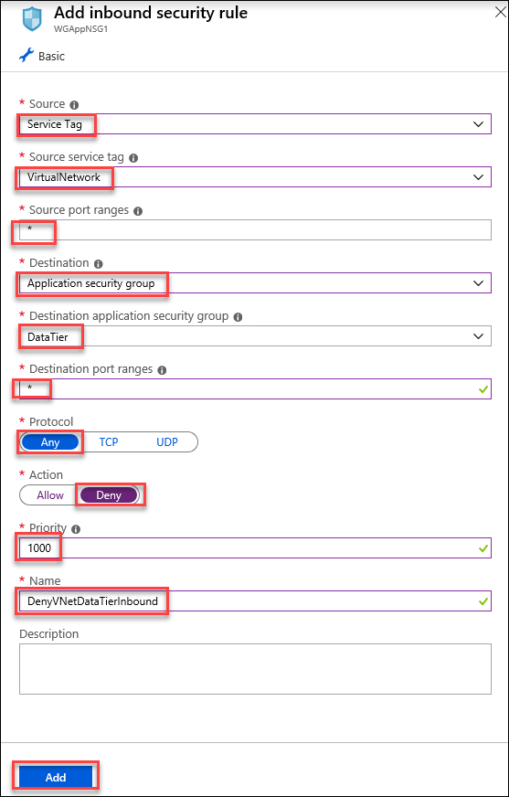

13. On the **WGAppNSG1 - Inbound security rules** blade, select **Add**.

14. On the **Add inbound security rule** blade, enter the following information, and select **Add**:

    -  Source: **Service Tag**

    -  Source service tag: **VirtualNetwork**

    -  Source port ranges: **\***

    -  Destination: **Application security group**

    -  Destination application security group: **WebTier**

    -  Destination port ranges: **\***

    -  Protocol: **Any**

    -  Action: **Deny**

    -  Priority: **1050**

    -  Name: **DenyVNetWebTierInbound**

    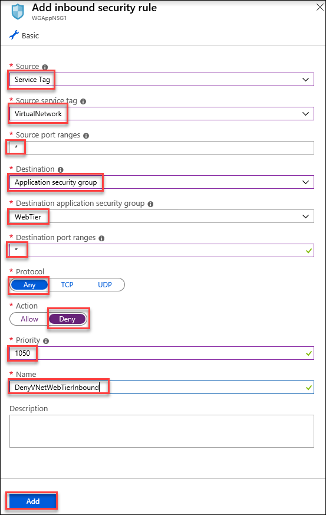

15. On the **WGAppNSG1 - Inbound security rules** blade, select **Subnets** under **Settings** and then select **+ Associate**.

16. On the **Associate subnet** blade, select **WGVNet2** on the **Virtual network** drop down and **AppSubnet** on the **Subnet** dropdown.

17. Select **OK** at the bottom of the **Associate subnet** blade.

## Exercise 10: Validate connectivity from 'on-premises' to Azure

Duration: 30 minutes

In this exercise, you will validate connectivity from your simulated on-premises environment to Azure.

### Task 1: Create a virtual machine to validate connectivity

1.  Create a new virtual machine in the OnPremVnet virtual network. In the Azure portal, select **+ Create a resource** and select **Windows Server 2016 Datacenter**.

2.  On the **Create a virtual machine** blade, on the **Basics** tab, enter the following information, and select **Next : Disks >**:

    -  Subscription: **Select your subscription*.

    -  Resource group: Select **Create new** and enter **OnPremVMRG**.

    -  Virtual machine name: **OnPremVM**

    -  Region: **(US) East US** (This must much the region you created the OnPremVNet virtual network.)

    -  Availability options: **No infrastructure redundancy required**

    -  Image: **[smalldisk] Windows Server 2016 Datacenter**

    -  Size: **Standard DS1 v2**

    -  User name: **demouser**

    -  Password: **demo\@pass123**

    -  Public inbound ports: **Allow selected ports**

    -  Select inbound ports: **RDP**

    -  Already have a Windows license?: **No**

3.  On the **Create a virtual machine** blade, on the **Disks** tab, set the following configuration and select **Next : Networking >**:

    -  OS disk type: **Premium SSD**

4.  On the **Create a virtual machine** blade, on the **Networking** tab, set the following configuration and select **Next : Management >**:

    -  Virtual network: **OnPremVNet**

    -  Subnet: **OnPremManagementSubnet (192.168.2.0/29)**

    -  Public IP: **(new)OnPremVM-ip**

    -  NIC network security group: **Basic**

    -  Public inbound ports: **Allow selected ports**

    -  Select inbound ports: **RDP**

    -  Accelerated networking: **Off**

    -  Place this virtual machine behind an existing load balancing solution: **No**

5.  On the **Create a virtual machine** blade, on the **Management** tab, set the following configuration and select **Review + create**:

    -  Boot diagnostics: **Off**

    -  OS guest diagnostics: **Off**

    -  System assigned managed identity: **Off**

    -  Enable auto-shutdown: **Off**

6.  On the **Create a virtual machine** blade, on the **Review + Create** tab, ensure the validation passes, and select **Create**. The virtual machine will take about 5 minutes to provision.

### Task 2: Configure routing for simulated 'on-premises' to Azure traffic

When packets arrive from the simulated 'on-premises' Virtual Network (OnPremVNet) to the 'Azure-side' (WGVNet1), they arrive at the gateway WGVNet1Gateway. This gateway is in a gateway subnet (10.7.0.0/29). For packets to be directed to the Azure firewall, we need another route table and route to be associated with the gateway subnet on the 'Azure-side'.

1.  On the Azure portal select **All services** at the left navigation. Enter **Route** in the search box, and select **Route tables**.

2.  On the **Route tables** blade, select **Add**.

3.  On the **Create route table** blade, enter the following information:

    -  Name: **WGAzureVNetGWRT**

    -  Subscription: **Select your subscription**.

    -  Resource group: Select the drop-down menu, and select **WGVNetRG1**.

    -  Location: **(US) South Central US** (This must match the location in which you created the **WGVNet1** virtual network.)

    -  Virtual network gateway route propagation: **Enable**

    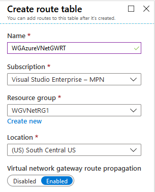

4.  Select **Create**.

5.  Select the **WGAzureVNetGWRT** route table.

    

6.  Select **Routes**.

7.  On the **Routes** blade, select the **+Add** button. Enter the following information, and select **OK**:

    -  Route name: **OnPremToAppSubnet**

    -  Address prefix: **10.8.0.0/25**

    -  Next hop type: **Virtual appliance**

    -  Next hop address: **10.7.1.4**

    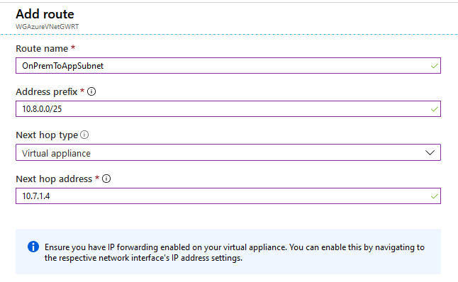

8.  On the **WGAzureVNetGWRT - Routes** blade, select **Subnets** under **Settings** on the left.

9.  On the **Subnets** blade, select **Associate**.

10. On the **Associate subnet** blade, select **WGVNet1** under the **Virtual Network** drop down and select **GatewaySubnet** under the **Subnet** drop down.

    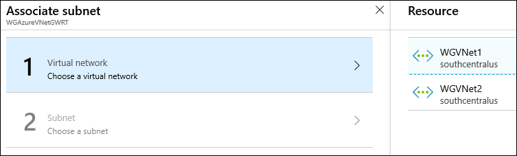

    >**Note:** At this point, you have configured your enterprise network. You should be able to test your Enterprise Class Network from one region to another. Your testing can include the following scenarios:

    -  On the 'on-premises' virtual machine (OnPremVM), attempt to initiate a Remote Desktop session to any virtual machine on the AppSubnet (10.8.0.0/25). Note that this should fail since it is blocked by Azure Firewall.

    -  On the jump host virtual machine (WGMGMT1), open Internet Explorer and browse to the web application deployed to the WGVnet2 via the private IP address of the Azure Load Balancer(10.8.0.100). Note that this traffic is routed (and allowed) via Azure Firewall.

    -  On the jump host virtual machine (WGMGMT1), initiate a Remote Desktop session to the WGWEB1 via its private IP address (10.8.0.4). This should be successful since it is allowed by Azure Firewall. However, an attempt to connect via Remote Desktop to the WGSQL1 via its private IP address should fail since it is blocked by a network security group.

    -  On the jump host virtual machine (WGMGMT1), initiate a Remote Desktop session to the WGWEB2 via its private IP address (10.8.0.5). This should be successful since it is allowed by Azure Firewall. However, an attempt to connect via Remote Desktop to the WGSQL1 via its private IP address should fail since it is blocked by a network security group.

    -  On the jump host virtual machine (WGMGMT1), initiate a Remote Desktop session to the WGSQL1 via its private IP address (10.8.1.4). This should be successful since it is allowed by Azure Firewall.

## Exercise 11: Using Network Watcher to Test and Validate Connectivity

Duration: 60 minutes

In this exercise, you will collect the flow log and perform connectivity from your simulated on-premises environment to Azure. This will be accomplished by using the Network Watcher Service in the Azure Platform.

### Task 1: Configuring the Storage Account for the NSG Flow Logs

1. On the Azure portal select **+ Create a resource**. From the Azure Marketplace menu select **storage** then select **Storage Account**

2. On the **Create Storage account** blade. Enter the following information, and select **Review + Create** then select the **Create** button:

    -  Subscription: **Your Subscription**

    -  Resource Group: **MonitoringRG** (Use the existing resource group created earlier.)

    -  Storage Account Name: **This must be Unique and alphanumeric, lowercase and no special characters.**

    -  Location: **South Central US**

    -  Performance: **Standard**

    -  Account Kind: **StorageV2 (general purpose v2)**

    -  Replication: **Locally-redundant storage (LRS)**

    -  Access Tier Default: **Hot**

    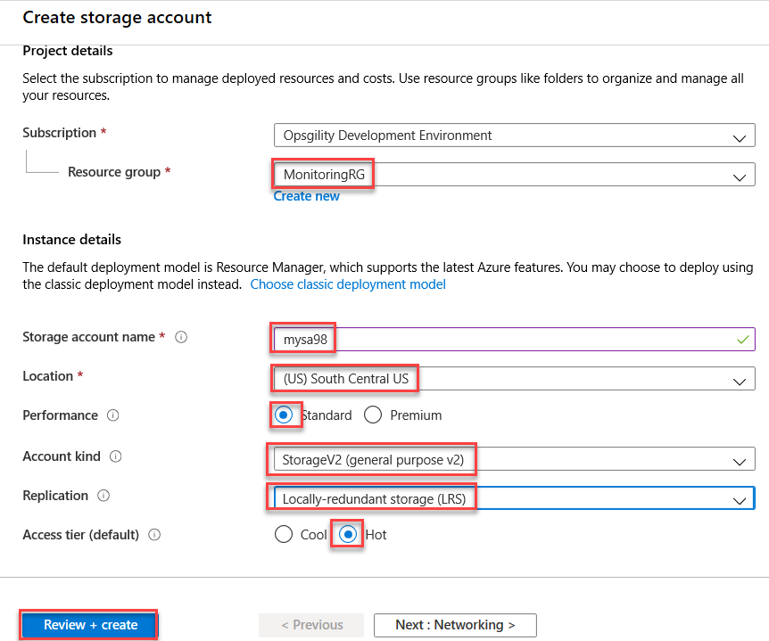

   >**Note:** Ensure the storage account is created before continuing.

3. Repeat step 2, but select **East US** for the region and give it a different name.

3. On the Azure portal select **All services** at the left navigation. From the Categories menu select **Networking** then select **Network Watcher**.

4. From the **Network Watcher** blade under the **Logs** menu select **NSG flow logs**. You will see both the **OnPremVM-nsg** and **WGAppNSG1** Network Security Groups.

    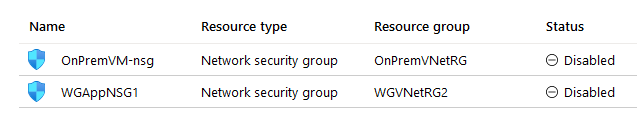

5. Select the **WGAppNSG1** network security group to open the flow log settings. Select **On** and then select **Version 2** for the Flow logs version.

6. Select **Storage Account-Configure**. From the drop down select the available storage account created earlier, then the **OK** button.

    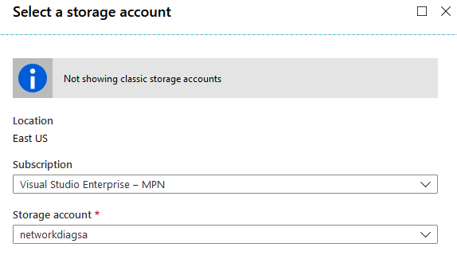

7. Select **On** to enable the traffic analytics status and set the interval to 10 minutes. Select the **Log Analytics Workspace** created earlier. Select **Save** at the top to confirm the settings.  

    

8. Repeat Steps 4 - 7 to enable the **OnPremVM-nsg** Network Security Group as well. When completed your configuration should show as the following image.

     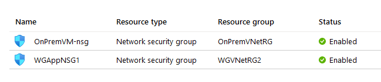

9. Navigate back to the **OnPremVM**. Connect to it by downloading and opening the RDP file. Then open another RDP connection to the **WGMGMT1** virtual machine within the connection to **OnPremVM**. In the RDP connection to **WGMGMT1**, navigate to the load balancer's private ip and generate some traffic by refreshing the browser. Allow ten minutes to pass for traffic analytics to generate.  

     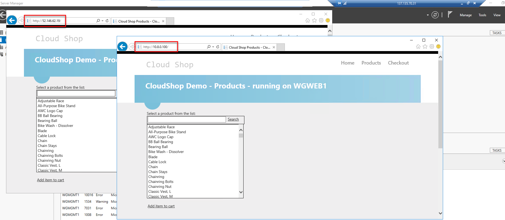

### Task 2: Configuring Diagnostic Logs

1. On the Azure portal, select **All services** at the left navigation. From the Categories menu select **Networking**, then **Network Watcher**,

2. Select **Diagnostic Logs** from the **Logs Menu** within the blade.

     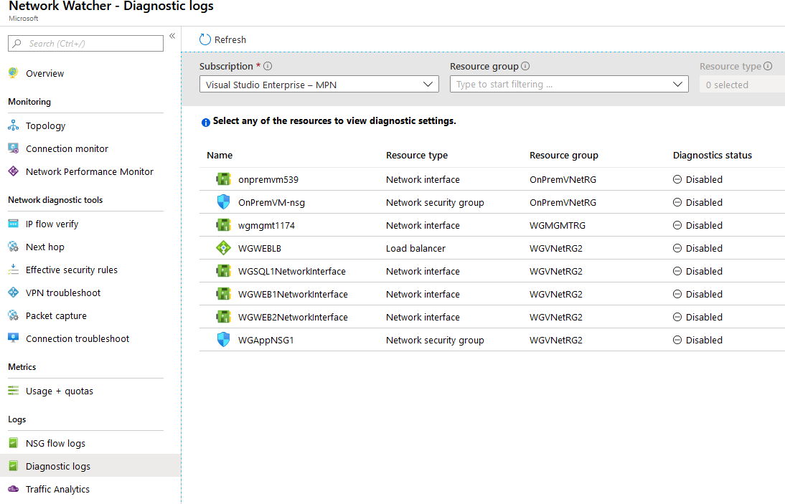

3. Select **onpremvmXXX** then select **+Add diagnostic setting**.

4. Enter **OnPremDiag** as the name then select the checkbox for **Archive to a storage account**. Select **Storage account** and from the drop down select the available storage account you created earlier. Select **OK**. 

     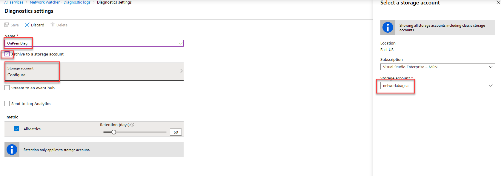

5. Select the **Send to Log Analytics** checkbox. Select the workspace created earlier. Select the **AllMetrics** checkbox and set the **Retention (days)** to **60**. Select the **Save** button to complete the settings.

     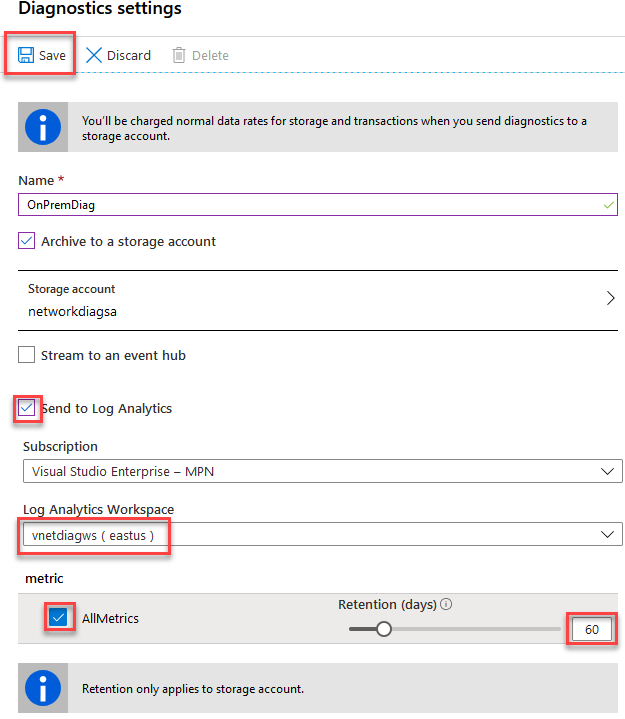

6. Repeat Steps 2 - 5 for each network resource. Once completed your settings will look like the following screenshot.

     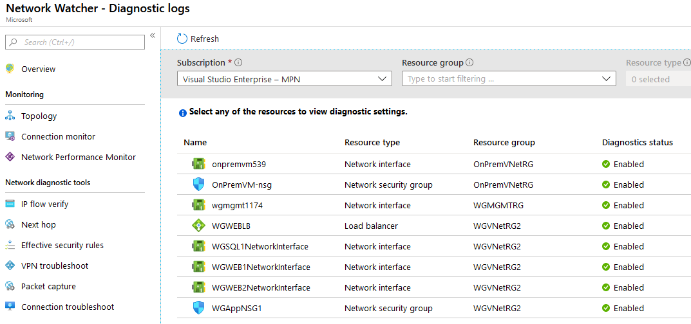

### Task 3: Reviewing Network Traffic

1. On the Azure portal select **All services** at the left navigation. From the Categories menu select **Networking** then select **Network Watcher**.

2. Select **Traffic Analytics** from the **Logs** menu in the blade. At this time the diagnostic logs from the network resources have been ingested. Select **View map**.

     

3. Select the **green check mark** which identifies your network. Within the pop up menu select **More Details** to propagate detailed information of the flow to and from your network.

     

>**Note:** You can select the **See More** link to query the connections detail for more information.

### Task 4: Network Connection Troubleshooting

1. On the Azure portal select **All services** at the left navigation. From the Categories menu select **Networking** then select **Network Watcher**.

2. Select **Connection Troubleshoot** from the **Network Diagnostic tools** menu.

3. To troubleshoot a connection or to validate the route enter the following information and select **Check**:
   
    -  Subscription: **Your Subscription**

    -  Resource Group: **OnPremVMRG**

    -  Source Type: **Virtual Machine**

    -  Virtual Machine: **OnPremVM**

    -  Destination: **Select a virtual machine**
 
    -  Resource Group: **WGVNetRG2**
 
    -  Virtual Machine: **WGWEB1**

    -  Probe Settings: **TCP**
    
    -  Destination Port: **80**

     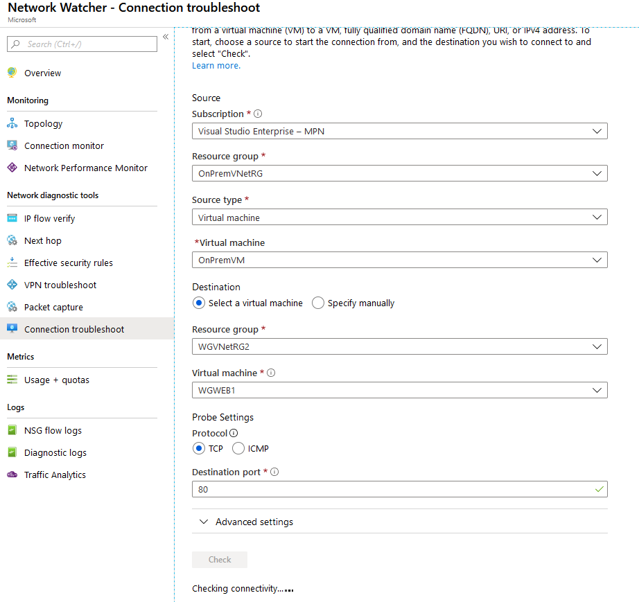

4. Once the check is complete the connection troubleshoot feature will display a grid view on the name, IP Address Status and Next hop as seen in the following screenshot. 

     

## After the hands-on lab

Duration: 10 minutes

After you have successfully completed the Enterprise-class networking in Azure hands-on lab step-by-step, you will want to delete the Resource Groups. This will free up your subscription from future charges.

You should follow all steps provided *after* attending the Hands-on lab.
