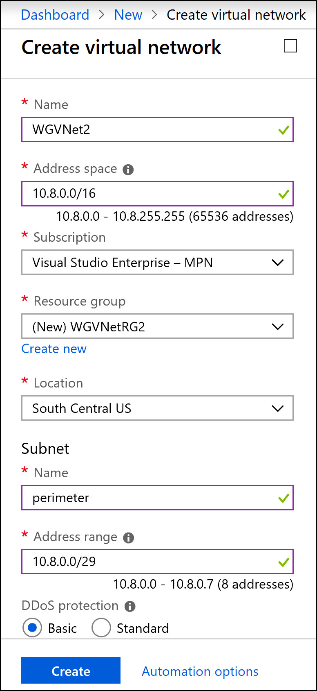
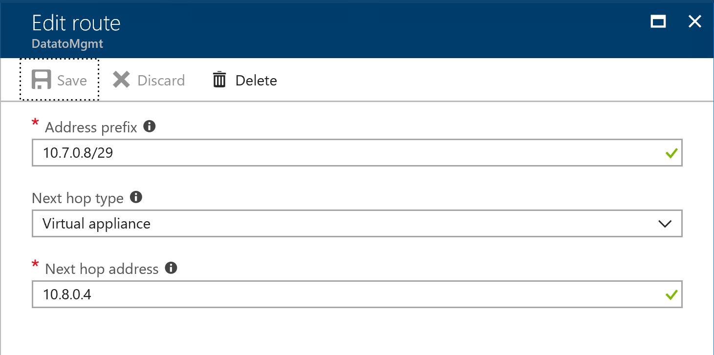
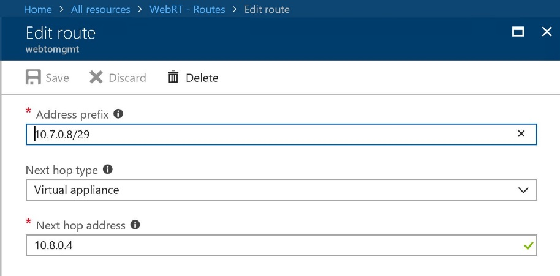
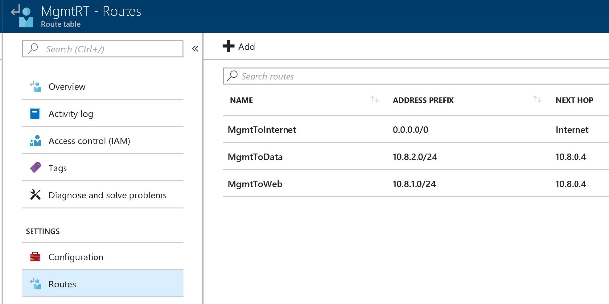
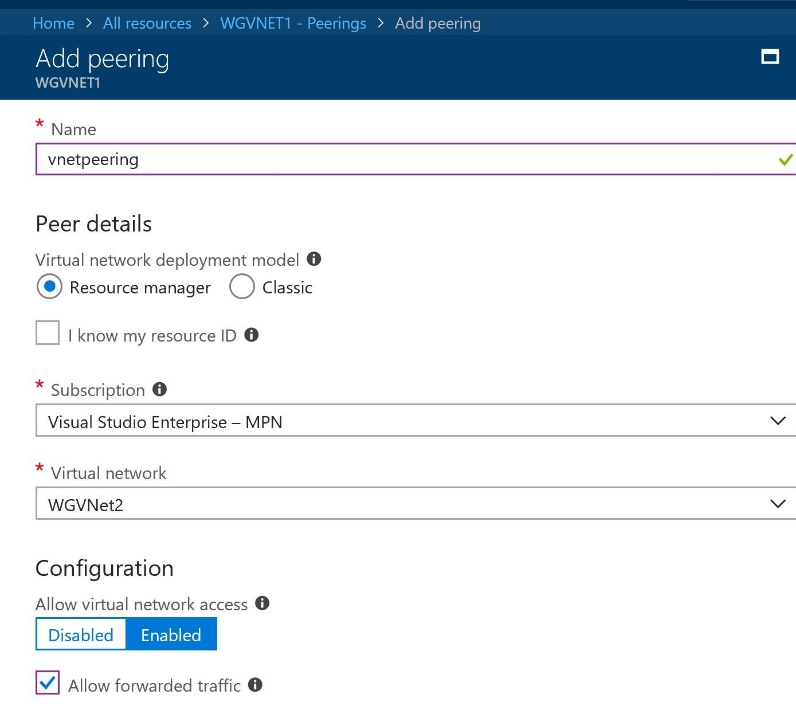
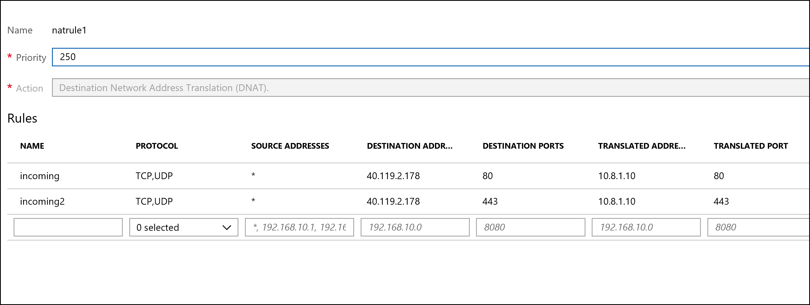
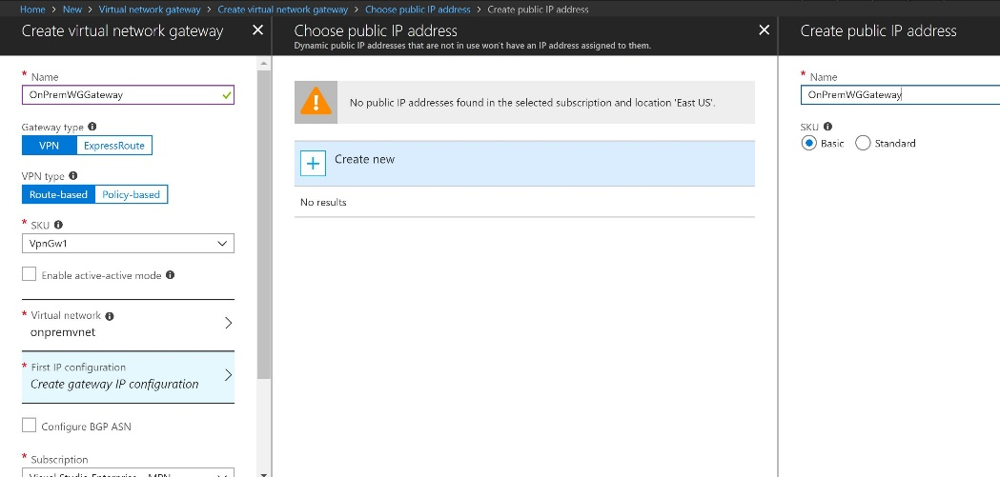
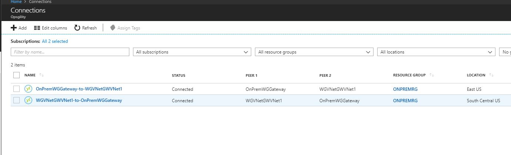
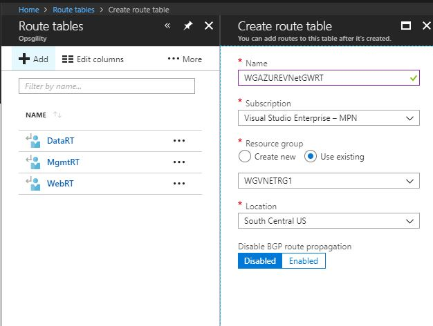

Enterprise-class networking in Azure

Hands-on lab step-by-step

January 2019

Information in this document, including URL and other Internet Web site references, is subject to change without notice. Unless otherwise noted, the example companies, organizations, products, domain names, e-mail addresses, logos, people, places, and events depicted herein are fictitious, and no association with any real company, organization, product, domain name, e-mail address, logo, person, place or event is intended or should be inferred. Complying with all applicable copyright laws is the responsibility of the user. Without limiting the rights under copyright, no part of this document may be reproduced, stored in or introduced into a retrieval system, or transmitted in any form or by any means (electronic, mechanical, photocopying, recording, or otherwise), or for any purpose, without the express written permission of Microsoft Corporation.

Microsoft may have patents, patent applications, trademarks, copyrights, or other intellectual property rights covering subject matter in this document. Except as expressly provided in any written license agreement from Microsoft, the furnishing of this document does not give you any license to these patents, trademarks, copyrights, or other intellectual property.

The names of manufacturers, products, or URLs are provided for informational purposes only and Microsoft makes no representations and warranties, either expressed, implied, or statutory, regarding these manufacturers or the use of the products with any Microsoft technologies. The inclusion of a manufacturer or product does not imply endorsement of Microsoft of the manufacturer or product. Links may be provided to third party sites. Such sites are not under the control of Microsoft and Microsoft is not responsible for the contents of any linked site or any link contained in a linked site, or any changes or updates to such sites. Microsoft is not responsible for webcasting or any other form of transmission received from any linked site. Microsoft is providing these links to you only as a convenience, and the inclusion of any link does not imply endorsement of Microsoft of the site or the products contained therein.

© 2019 Microsoft Corporation. All rights reserved.

Microsoft and the trademarks listed at <https://www.microsoft.com/en-us/legal/intellectualproperty/Trademarks/Usage/General.aspx> are trademarks of the Microsoft group of companies. All other trademarks are property of their respective owners

**Contents**

<!-- TOC -->autoauto- [Enterprise-class networking in Azure hands-on lab step-by-step](#enterprise-class-networking-in-azure-hands-on-lab-step-by-step)auto    - [Abstract and learning objectives](#abstract-and-learning-objectives)auto    - [Overview](#overview)auto    - [Solution architecture](#solution-architecture)auto    - [Requirements](#requirements)auto    - [Help references](#help-references)auto    - [Exercise 1: Create a Virtual Network and provision subnets](#exercise-1-create-a-virtual-network-and-provision-subnets)auto        - [Task 1: Create a Virtual Network](#task-1-create-a-virtual-network)auto        - [Task 2: Configure subnets](#task-2-configure-subnets)auto    - [Exercise 2: Create second Virtual Network and provision subnets](#exercise-2-create-second-virtual-network-and-provision-subnets)auto        - [Task 1: Create a second Virtual Network](#task-1-create-a-second-virtual-network)auto        - [Task 2: Configure Subnets](#task-2-configure-subnets)auto    - [Exercise 3: Create route tables with required routes](#exercise-3-create-route-tables-with-required-routes)auto        - [Task 1: Create route tables](#task-1-create-route-tables)auto        - [Task 2: Add routes to each route table](#task-2-add-routes-to-each-route-table)auto    - [Exercise 4: Deploy n-tier application and validate functionality](#exercise-4-deploy-n-tier-application-and-validate-functionality)auto        - [Task 1: Use the Azure portal for a template deployment](#task-1-use-the-azure-portal-for-a-template-deployment)auto        - [Task 2: Validate the CloudShop application is up after the deployment](#task-2-validate-the-cloudshop-application-is-up-after-the-deployment)auto        - [Task 3: Create a load balancer to distribute load between the web servers](#task-3-create-a-load-balancer-to-distribute-load-between-the-web-servers)auto        - [Task 4: Configure the load balancer](#task-4-configure-the-load-balancer)auto    - [Exercise 5: Build the management station](#exercise-5-build-the-management-station)auto        - [Task 1: Build the management VM](#task-1-build-the-management-vm)auto    - [Exercise 6: Virtual Network Peering](#exercise-6-virtual-network-peering)auto        - [Task 1: Configure VNet peering WGVNET1 to WGVNET2](#task-1-configure-vnet-peering-wgvnet1-to-wgvnet2)auto        - [Task 2: Configure VNet peering WGVNET2 to WGVNET1](#task-2-configure-vnet-peering-wgvnet2-to-wgvnet1)auto    - [Exercise 7: Provision and configure Azure firewall solution](#exercise-7-provision-and-configure-azure-firewall-solution)auto        - [Task 1: Provision the Azure firewall appliance](#task-1-provision-the-azure-firewall-appliance)auto        - [Task 2: Create Firewall Rules](#task-2-create-firewall-rules)auto        - [Task 3: Associate route tables to subnets](#task-3-associate-route-tables-to-subnets)auto        - [Task 4: Associate route tables to subnets](#task-4-associate-route-tables-to-subnets)auto    - [Exercise 8: Configure Site-to-Site connectivity](#exercise-8-configure-site-to-site-connectivity)auto        - [Task 1: Create OnPrem Virtual Network](#task-1-create-onprem-virtual-network)auto        - [Task 2: Configure gateway subnets for on premise Virtual Network](#task-2-configure-gateway-subnets-for-on-premise-virtual-network)auto        - [Task 3: Create the first gateway](#task-3-create-the-first-gateway)auto        - [Task 4: Create the second gateway](#task-4-create-the-second-gateway)auto        - [Task 5: Connect the gateways](#task-5-connect-the-gateways)auto    - [Exercise 9: Validate connectivity from 'on-premises' to Azure](#exercise-9-validate-connectivity-from-on-premises-to-azure)auto        - [Task 1: Create a virtual machine to validate connectivity](#task-1-create-a-virtual-machine-to-validate-connectivity)auto        - [Task 2: Configure routing for simulated 'on-premises' to Azure traffic](#task-2-configure-routing-for-simulated-on-premises-to-azure-traffic)auto    - [After the hands-on lab](#after-the-hands-on-lab)autoauto<!-- /TOC -->
# Enterprise-class networking in Azure hands-on lab step-by-step

## Abstract and learning objectives

In this hands-on lab, you will setup and configure a virtual network with subnets in Azure. You will also learn how to secure the virtual network by deploying a network virtual appliances and configure route tables on the subnets in your virtual network. Additionally, you will set up access to the virtual network with a jump box and a site-to-site VPN connection.

At the end of this hands-on lab, you will be better able to configure Azure networking components. 

## Overview

You have been asked by Woodgrove Financial Services to provision a proof of concept deployment that will be used by the Woodgrove team to gain familiarity with a complex Virtual Networking deployment, including all of the components that enable the solution. Specifically, the Woodgrove team will be learning about:

-   How to bypass system routing to accomplish custom routing scenarios.

-   How to capitalize on load balancers to distribute load and ensure service availability.

-   How to implement a partner firewall solution to control traffic flow based on policies.

The result of this proof of concept will be an environment resembling this diagram:

## Solution architecture

## Requirements

You must have a working Azure subscription to carry out this hands-on lab step-by-step without a spending cap to deploy the Barracuda firewall from the Azure Marketplace.

## Help references

|    |            |
|----------|:-------------:|
| **Description** | **Links** |
| IP Addressing and Subnetting for New Users   | http://www.cisco.com/c/en/us/support/docs/ip/routing-information-protocol-rip/13788-3.html  |
| CIDR / VLSM Supernet Calculator  | <http://www.subnet-calculator.com/cidr.php>  |
| Virtual Network documentation  | <https://azure.microsoft.com/en-us/documentation/services/virtual-network/>  |
| Network Security Group documentation  | <https://azure.microsoft.com/en-us/documentation/articles/virtual-networks-nsg/>  |
| IP addresses in Azure      |  https://azure.microsoft.com/en-us/documentation/articles/virtual-network-ip-addresses-overview-arm/ |
| User-Defined Routing and IP Forwarding   | <https://azure.microsoft.com/en-us/documentation/articles/virtual-networks-udr-overview/>  |
| Load Balancer       | <https://azure.microsoft.com/en-us/documentation/articles/load-balancer-overview/>  |
| Implementing a DMZ between Azure and your on-premises data center    |  <https://azure.microsoft.com/en-us/documentation/articles/guidance-iaas-ra-secure-vnet-hybrid/>  |

## Exercise 1: Create a Virtual Network and provision subnets

Duration: 15 minutes

### Task 1: Create a Virtual Network

1.  From your **LABVM**, connect to the Azure portal, select **New**, and in the list of Marketplace categories, select **Networking** followed by selecting **Virtual Network**. See the following screenshot for more details.

2.  On the **Create virtual network** blade, enter the following information:

    a.  Name: **WGVNet1**

    b.  Address space: **10.7.0.0/16**

    c.  Subscription: **Choose your subscription**.

    d.  Resource group: Select **Create new**, and enter the name **WGVNetRG1**.

    e.  Location: **South central**

    f.  Subnet name: **GatewaySubnet**

    g.  Subnet address range: **10.7.0.0/29**
    
    **Leave the other options as default for now**

    Upon completion, it should look like the following screenshot. Validate the information is correct, and select **Create**.

    

3.  Monitor the deployment status by selecting **Notifications Bell** at the top of the portal. In a minute or so, you should see a confirmation of the successful deployment. Select **Go to Resource**.

### Task 2: Configure subnets

1.  Go to the WGVNetRG1 Group, and select **WGVNet1 Virtual Network** blade, and select **Subnets**.

    

2.  In the **Subnets** blade select **+Subnet**.

    

3.  On the **Add subnet** blade, enter the following information:

    a.  Name: **Management**

    b.  Address range: **10.7.0.8/29**

    c.  Network security group: **None**

    d.  Route table: **None**

    e. Service Endpoints: **Leave as Default**.

    When your dialog looks like the following screenshot, choose **OK** to create the subnet.

    

## Exercise 2: Create second Virtual Network and provision subnets

Duration: 15 minutes

### Task 1: Create a second Virtual Network

1.  On the **Create virtual network** blade referenced above in Exercise 1 Task 1, enter the following information:

    a.  Name: **WGVNet2**

    b.  Address space: **10.8.0.0/16**

    c.  Subscription: **Choose your subscription**.

    d.  Resource group: Select **Create new**, and enter the name **WGVNetRG2**.

    e.  Location: **South Central**

    f.  Subnet name: **AzureFirewallSubnet** (this name is fixed and cannot be changed)

    g.  Subnet address range: **10.8.0.0/26** (/26 is minimum requirement for azure firewall)

    Upon completion, it should look like the following screenshot. Validate the information is correct, and choose **Create**.

    

### Task 2: Configure Subnets

1.  Go to the WGVNetRG2 Resource Group, and select **WGVNet2** blade, and select **Subnets**.

    

2.  In the **Subnets** blade, select **+Subnet**.

    

3.  On the **Add subnet** blade, enter the following information:

    a.  Name: **DataTier**

    b.  Address range: **10.8.2.0/24**

    c.  Network security group: **None**

    d.  Route table: **None**

4.  Repeat steps 3 to create the **WebTier** subnet:

    a.  Name: **WebTier**

    b.  Address range: **10.8.1.0/24**

    c.  Network security group: **None**

    d.  Route table: **None**

    When your dialog looks like the following screenshot, select **OK** to create the subnet.

    The result should look like the following screenshot:

    

## Exercise 3: Create route tables with required routes

Duration: 15 minutes

Route Tables are containers for User Defined Routes (UDRs). The route table is created and associated with a subnet. UDRs allow you to direct traffic in ways other than normal system routes would. In this case, UDRs will direct traffic from 'internal' subnets to the firewall appliance.

### Task 1: Create route tables

1.  On the main portal menu, select **+ Create a Resource**. Type **route** into the search box, and choose **Route tables** then select Create

2.  On the **Create a Route table** blade enter the following information:

    a.  Name: **MgmtRT**

    b.  Subscription: **Choose your subscription**.

    c.  Resource group: Select **Use existing**, choose the drop-down menu, and select **WGVNetRG1**.

    d.  Location: **South Central**

    When the dialog looks like the following screenshot, select Create.
    
    

3.  After a few seconds, if the new route table does not show in the portal, select **Refresh**.

4.  After you see the route table you created, complete steps 2 and 3 again to create the **DataRT** route table:

    a.  Name: **DataRT**

    b.  Subscription: **Choose your subscription**.

    c.  Resource group: Select **Use existing**, select the drop-down menu, and select **WGVNetRG2**.

    d.  Location: **south central**

5.  After you see the **DataRT** route table created (you may need to select **Refresh** again), complete steps 2 and 3 again to create the **WebRT** route table:

    a.  Name: **WebRT**

    b.  Subscription: **Choose your subscription**.

    c.  Resource group: Select **Use existing**, choose the drop-down menu, and select **WGVNetRG2**.

    d.  Location: **South Central**

6.  Once route tables are created, your **Route tables** blade should look like the following screenshot:

    

### Task 2: Add routes to each route table

1.  Select on the **DataRT** route table, and choose **Routes**.

    

2.  On the **Routes** blade, choose +**Add**. Enter the following information, and select **OK**:

    a.  Route name: **DataToInternet**

    b.  Address prefix: **0.0.0.0/0**

    c.  Next hop type: **Virtual appliance**

    d.  Next hop address: **10.8.0.4**

    

3.  Repeat this procedure to add the **DataToMgmt** route using the following information:

    a.  Route name: **DataToMgmt**

    b.  Address prefix: **10.7.0.8/29**

    c.  Next hop type: **Virtual appliance**

    d.  Next hop address: **10.8.0.4**

    

4.  Repeat this procedure to add the **DataToWeb** route using the following information:

    a.  Route name: **DataToWeb**

    b.  Address prefix: **10.8.1.0/24**

    c.  Next hop type: **Virtual appliance**

    d.  Next hop address: **10.8.0.4**

    

    Upon completion, your routes in the **DataRT** route table should look like the following screenshot:

    

5.  In the Azure Portal, go to All Services and type Route in the search box and select **Route tables**

6.  Choose **WebRT** followed by **Routes**.

    

7.  On the **Routes** blade, select +**Add**. Enter the following information, and choose **OK**:

    a.  Route name: **WebToInet**

    b.  Address prefix: **0.0.0.0/0**

    c.  Next hop type: **Virtual appliance**

    d.  Next hop address: **10.8.0.4**

    

8.  Repeat this procedure to add the **WebToData** route using the following information:

    a.  Route name: **WebToData**

    b.  Address prefix: **10.8.2.0/24**

    c.  Next hop type: **Virtual appliance**

    d.  Next hop address: **10.8.0.4**

    

9.  Repeat this procedure add the **WebToMgmt** route using the following information:

    a.  Route name: **WebToMgmt**

    b.  Address prefix: **10.7.0.8/29**

    c.  Next hop type: **Virtual appliance**

    d.  Next hop address: **10.8.0.4**

    

    Upon completion, your routes in the **WebRT** route table should look like the following screenshot:

    

10. In the Azure Portal, go back to **Route tables** blade to see the list of Route tables. 

    

11. Select **MgmtRT**, and choose **Routes**.

    

12. On the **Routes** blade, choose +**Add**. Enter the following information, and choose **OK**:

    a.  Route name: **MgmtToInternet**

    b.  Address prefix: **0.0.0.0/0**

    c.  Next hop type: **Internet**

    d.  Next hop address: **Leave it blank**.

    

13. Complete step 12 to add the **MgmtToData** route using the following information:

    a.  Route name: **MgmtToData**

    b.  Address prefix: **10.8.2.0/24**

    c.  Next hop type: **Virtual appliance**

    d.  Next hop address: **10.8.0.4**

    

14. Complete step 12 to add the **MgmtToWeb** route using the following information:

    a.  Route name: **MgmtToWeb**

    b.  Address prefix: **10.8.1.0/24**

    c.  Next hop type: **Virtual appliance**

    d.  Next hop address: **10.8.0.4**

    

    Upon completion, your routes in the **MgmtRT** route table should look like the following screenshot:

    

>**Note:** The route tables and routes you have just created are not associated with any subnets yet, so they are not impacting any traffic flow yet. This will be accomplished later in the lab.

## Exercise 4: Deploy n-tier application and validate functionality

Duration: 90 minutes

In this task, you will provision the CloudShop application using an ARM template deployment. This application has a web tier and a data tier.

### Task 1: Use the Azure portal for a template deployment

>**Note:** If you have not downloaded the student files see this section in the before getting started section of this hands-on lab.

1.  On your LABVM, open the **C:\\ECN-Hackathon** which contains the student files for this lab.

2.  Sign into the Azure portal at <http://portal.azure.com>.

3.  Choose **+Create a resource**, and search for template deployment.

4.  Select the template deployment link, and choose Create.

    

5.  On the Custom deployment blade, select **Build your own template in the editor**.

    

6.  Choose **Load file** and select the **CloudShop.json** file from your **C:\\ECN-Hackathon** directory and then select **Save**.

    

7.  Update the following parameters to reference the **WGVNet2** virtual network in the **WGVNetRG2** resource group.

    

8.  Update the **Custom deployment** blade using the following inputs, agree to the terms, and choose **Purchase**. This deployment will take approximately 30-40 minutes.

    a.  Resource Group: Create new / **WGVMRGTMT**

    b.  Location: **South Central**

    

### Task 2: Validate the CloudShop application is up after the deployment

1.  Using the Azure portal, open the **WGVMRG** Resource group and review the deployment.

2.  Open the **WGWEB1** blade in the Azure portal, and choose **Connect**.

    

3.  Depending on your Remote Desktop protocol client and browser configuration, you will either be prompted to open an RDP file, or you will need to download it and then open it separately to connect.

4.  Log in with the credentials specified during creation:

    a.  User: **demouser**

    b.  Password: **demo\@pass123**

5.  You will be presented with a Remote Desktop Connection warning because of a certificate trust issue. Select **Yes** to continue with the connection.

    

6.  When logging on for the first time, you will have a prompt asking about network discovery. Select **No**.

    

7.  Notice that Server Manager opens by default. Choose **Local Server**.

    

8.  On the pane, select **On** by **IE Enhanced Security Configuration**.

    

9.  Change to **Off** for Administrators, and select **OK**.

    

10. You will now ensure the CloudShop application is up and running. Open Internet explorer, and browse to both the WGWEB1 and WGWEB2 servers:

    http://wgweb1

    http://wgweb2

### Task 3: Create a load balancer to distribute load between the web servers

1.  In the Azure portal, choose **New**, then Networking, Load Balancer.

    

2.  In the **Create load balancer** blade, enter the following values:

    a.  Name: **WGWEBLB**

    b.  Type: **Internal**

    c.  Virtual network: **WGVNet2**

    d.  Subnet: **WebTier**

    e.  IP address assignment: Choose **Static** and enter the IP address **10.8.1.10**.

    f.  Subscription: **Choose your subscription**.

    g.  Resource group: **Use existing** and select **WGVNETRG2**.

    h.  Location: **South Central US**

    Ensure your **Create load balancer** dialog looks like the following, and select **Create**.

    

### Task 4: Configure the load balancer

1.  Open the **WGWEBLB** load balancer in the Azure portal.

2.  Select **Backend pools**, and choose **+Add** at the beginning.

    

3.  Enter **LBBE** for the pool name. Under **Associated to**, choose **Availability set**.

    

4.  Next, select the **WebAVSet** Availability Set.

5.  Under **Target network IP configurations**, choose **+ Add a target network IP configuration**.

    

6.  Under **Target virtual machine**, choose **WGWEB1**.

    

7.  Under **Network IP configuration**, choose **WGWEB1VMNIC1**.

8.  Select **+ Add a target network IP configuration** repeating these steps, but this time, adding **WGWEB2** along with its IP configuration.

9. Then, choose **OK**.

10. Wait to proceed until the Backend pool configuration is finished updating.

    

11. Next, under **Settings on the WGWEBLB Load Balancer blade** select **Health** **Probes**. Choose +**Add**, and use the following information to create a health probe.

    a.  Name: **HTTP**

    b.  Protocol: **HTTP**

    
    
    
    
    

12. Choose **OK**.

    After the Health probe has updated. Select **Load balancing rules**. Choose +**Add** and complete the configuration as shown below followed by selecting **OK**.
    
    

    **It will take 2-3 minutes for the changes to save.**

13. From an RDP session to WGWEB1, open your browser and point it at <http://10.8.1.10>. Press F5 until you see both servers responding. Note: If you are unable to get the servers to switch based on refreshing that is ok.

    

    

14. Using the portal, disassociate the public IP from the NIC of **WGWEB1** **VM**. Do this by selecting the Networking section below on the VM.

    

15. Next, select the listed network interface **WGWEB1NetworkInterface** on the hyperlink.

16. Next, choose the **IP configurations** section shown.

    

17. Next, select the **ipconfig1** section on the NAME shown above.

18. Next, select and make sure that the **Public IP address settings** is shown disabled below, and choose **Save**. This should remove the public IP address from the network interface of the VM.

    

## Exercise 5: Build the management station

Duration: 15 minutes

In this exercise, management of the Azure-based systems will only be available from a management 'jump box.' In this section, you will provision this server.

### Task 1: Build the management VM

1.  In the Azure portal, select **+Create a resource** in the portal. In the marketplace category list, choose **Compute**. In the Featured Apps list, choose **Windows Server 2016 Datacenter**.

2.  On the **Basics** blade, shown in the following screenshot, enter the following information, and select **OK**:

    - Subscription: **Choose your subscription**.

    - Resource group: Choose **Create new** and enter **WGMGMTRG**.
      
    - VM Name: **WGMGMT1**

    - Region: **South Central US**

    - Image: **Windows Server 2016 Datacenter**
    
    - Size:  **F1S** (you will need to choose **View all** and scroll down to find the F1S size). Choose **Select**.

    - User name: **demouser**

    - Password: **demo\@pass123**

    - One the disk blade: **Premium SSD**

    - On the Storage blade, Under **Advanced**, select **No** for **Use managed disks**.

    - Under **Networking** blade, select the **Virtual network** section. On the **Choose Virtual Network** blade, choose **WGVNet1**.

    - In the **Subnet** section, select the subnet that was chosen, and choose **Management**

    - In the **Public IP address** section, select the name that was pre-populated. Then, select the **Choose Public IP address** and choose **None**.
    
    - Select the **Network security group**: **None**.

    - Under **Management**, for **Boot diagnostics and OS guest diagnostics**, choose **Off**.

    - At the bottom of the page select **Review + Create**, ensure the validation passes, and choose **Create**. The virtual machine will take 5-10 minutes to provision.

## Exercise 6: Virtual Network Peering

Duration: 20 Minutes

### Task 1: Configure VNet peering WGVNET1 to WGVNET2

1.  Select the resource group **WGVNetRG1**, and select the configuration blade for **WGVNET1**. Choose **Peerings**.

2.  Select **Add**.

    

3.  Name the new peering **VNETPeering** and check the box for allow forwarded traffic and select **OK** to create peerings.

    

### Task 2: Configure VNet peering WGVNET2 to WGVNET1

1.  Repeat the steps of Task 1, Steps 1 - 3 to create peering from resource group **WGVNetRG2 Resource Group** and the **WGVNET2 Virtual Network**.

## Exercise 7: Provision and configure Azure firewall solution

Duration: 15 minutes

In this exercise, you will provision and configure an Azure firewall appliance in your network. 

### Task 1: Provision the Azure firewall appliance

1.  Within the Azure portal, select **+ Create a resource** in the portal. In the search dialog, type **azure firewall** and select and click the **create** to open the create a firewall window

2.  On the **Basics** blade, enter the following information: 
   
    Select : **the right subscription**
   
    ResourceGroup - WGVNetRG2

    Name: **azurefirewall**

    Region: **south central US**

    Choose a Virtual network:  **use existing** select **WGVNet2**

    Public IP Address: **Create new**
    

    Select **Review + Create** to provision the Azure Firewall. 

   
    

### Task 2: Create Firewall Rules

Within 1-2 minutes, the resource group **WGVNetRG2** will have the firewall appliance create. Next, we will firewall rules to allow the inbound and outbound traffic.

1.  On the main Azure menu select **Resource groups**.

2.  Select the **WGVNetRG2** resource group. This resource group contains the azure firewall appliance.

    

3.  On the **Overview** page, select **Rules**. Then Select **+ Add NAT Rule collection** and enter the following information to create Inbound NAT Rule:
   
       a. Name: **natrule1**

       b. Priority: **250**

       c. Rules Name: **Incoming**

       d. protocol: **Select TCP and UDP**

       e. Source address: **(Any IP address from internet can hit the firewall)**

       f. Destination Address: **Firewall public IP Address. In this case 40. 119.2.178. Verify your Azure Firewall's public IP address**.

       g. Destination ports: **80 (Allow HTTP Traffic)**

       h. Translated Address: **10.8.1.10 (Azure Load Balancer Private IP)**
        
       i. Translated Port: **80**

    Repeat the above process and Create another rule for https similar to the screenshot below.

    

4.  On the Azure Firewall **Overview** page, select **Rules**. Then Select **+ Add Network Rule collection** and enter the following information to create Network Rule for outbound traffic. Any traffic from Azure Vnet to go outside via Azure Firewall. 

       a. Name: **outgoingrule**

       b. Priority: **100**

       c. Action: **Allow**

       d. Rules Name: **Outgoing**

       e. protocol: **Any**

       f. Source address: * 

       g. Destination Address: *

       h. Destination ports: *

    

### Task 3: Associate route tables to subnets

1.  Using the Azure portal, open the **WGVNetRG2** resource group.

2.  Select **DataRT**, followed by **Subnets**.

    

3.  Select the **+Associate**.

    

4.  On the **Associate subnet** blade, select **Virtual network**. Then, choose on **WGVNet2**.

    

5.  From the **Choose a subnet** blade, choose **DataTier**.

    

6.  Select **OK** at the bottom of the **Associate subnet** blade.

7.  Choose the **WGVNetRG1** resource group, and select **MgmtRT**, then **Subnets**.

8.  Select the **+Associate**.

    

9.  On the **Associate subnet** blade, select **Virtual network**. Choose **WGVNet1**.

    

10. The **Choose subnet** blade opens. Choose **Management**.

    

11. Select **OK** at the bottom of the **Associate subnet** blade.

12. Select the **WGVNetRG2** resource group and choose **WebRT** followed by **Subnets**.

13. Select **+Associate**.

    

14. On the **Associate subnet** blade, select **Virtual network**. Then, select **WGVNet2**.

    

15. The **Choose subnet** blade opens. Choose **WebTier**.

    

16. Select **OK** at the bottom of the **Associate subnet** blade.

### Task 4: Associate route tables to subnets

In this task you will enable DDoS services for your virtual network.

1. In the Azure Portal, select **+ Create a resource** and in the search box type **DDoS Protection Plan** and Select **Create**.
        
    

2. Name: **DDoSprotection**
3. Subscription: **Choose the right subscription**.
4. Resource group: **WGVNetRG2**
5. Location: **South Central**

    

    Once completed, select **Create** to enable DDoS protection. Wait few minutes to complete the provisioning.

 7. Now Go to Azure Portal **All Resources** - select and open **DDoSprotection** and in the **settings area** go to **Properties** take a note of **Resource ID** and **click to copy the ID**.

8. In the Azure Portal - Go to **Resource Group** - **WGVNetRG2** - Virtual Network **WGVNet2** in the settings areas select and open **DDos Protection** select **Standard** choose **I know my resource ID** AND Paste your Resource ID in the field. 

   

    Once completed click **Save**

## Exercise 8: Configure Site-to-Site connectivity

Duration: 60 minutes

In this exercise, we will simulate an on-premises connection to the internal web application. To do this, we will first set up another Virtual Network in a separate Azure region followed by the Site-to-Site connection of the 2 Virtual Networks Finally, we will set up a virtual machine in the new Virtual Network to simulate on-premises connectivity to the internal load-balancer.

### Task 1: Create OnPrem Virtual Network

1.  Using the Azure Management portal, choose **+Create a resource**, **Networking** and **Virtual network**.

2.  See the following screenshot, and specify the configuration:

    a.  Name: **OnPremVNet**
    
    b.  Address space: **192.168.0.0/16**
    
    c.  Subscription: **Choose your Subscription**
    
    d.  Resource Group: Create new: **OnPremVNetRG**
    
    e.  Subnet name: **default**
    
    f.  Subnet address range: **192.168.0.0/24**
    
    g.  Location: **East US**
    
    h.  Make sure this is **NOT** the same location you have specified in the previous exercises.

     |  |

### Task 2: Configure gateway subnets for on premise Virtual Network

1.  Select the **OnPremVnetRG** Resource Group and then open the **OnPremVNet** blade and choose **Subnets**.

2.  Next, choose +**Gateway subnet**.

    

3.  Specify the following configuration for the subnet, and select **OK**:

    a.  Address range: **192.168.1.0/29**

    b.  Route table: **None** (We will add later.)

    

4.  Next, select the Resource Group **OnPremVnetRG** and choose the **OnPremVNet Virtual Network**. Add an on- premise Management Subnet to the **OnPremVNet shown below in the screenshot.**

    

### Task 3: Create the first gateway

1.  Using the Azure Management portal, choose **+ Create a Resource**, type **Virtual Network gateway** in the search window, and select **Virtual Networks Gateways**.

2.  Select **+Add** on the toolbar.

    

3.  Name the gateway **OnPremWGGateway**.

    

4.  One of the last configurable options is the **Location**. Select this to choose the Azure region where **onpremvnet** exists (East US if following this guide).

5.  In the **Virtual network** section, select **Choose a Virtual Network**, and choose **OnPREMVNET**.

6.  Select the **Public IP address** tile, and choose **Create new**.

7.  Name the IP **onpremgwgateway**, and select **OK**.

    

8.  Validate your settings look like the following screenshot, and select **Create**.

    >**Note:** The gateway will take 30-45 minutes to provision. Continue to the next section while waiting.

### Task 4: Create the second gateway

1.  Using the Azure Management portal, choose **+ Create a resource**, type **Virtual Network gateway** in the search window, and choose **Virtual Networks Gateways**.

2.  Select **Add** on the toolbar.

3.  Name the gateway **WGVNetGWVNet1**.

4.  One of the last configurable options is the **Location**. Choose the Azure region where **WGVNet1** exists (South central US if following this guide).

    >**Note**: If you don't choose the location right after you put the name, right Virtual Network will not appear to create the Gateway.

5.  In the **Virtual network** section, select **Choose a Virtual Network** followed by **WGVNet1**.

    

6.  Select the **Public IP address** tile, and choose **Create new**.

7.  Name the IP **VNETGWIP** and select **OK**.

8.  Validate your settings look like the following screenshot, and select **Create**.

>**Note:** The gateway will take 30-45 minutes to provision. You will need to wait until both gateways are provisioned before proceeding to the next section.

9.  The Azure portal will notify you when the deployments have completed.

### Task 5: Connect the gateways

1.  Using the Azure Management portal, click **+Create a resource**, type in **Connection**, and press **Enter**.

2.  Select **Connection** and choose **Create**.

    

3.  On the **Basics** blade, leave the **Connection type** set to **VNet-to-VNet**. Select the existing **WGVNetRG1** resource group. Then, change the location of this connection to the Azure region the **WGVNet1** Virtual Network is deployed to (South central). Choose **OK**.

    

4.  On the Settings tab, select **WGVNetGWVNet1** for the first Virtual Network gateway and **OnPremWGGateway** for the second Virtual Network gateway. Ensure **Establish bidirectional connectivity** is selected. Enter a Shared key, such as **A1B2C3D4** for example. After your settings reflect the below screenshot, select **OK**.

    

    **Second gateway**

    

    Finally, the configuration will look like the following screenshot after selecting all the fields:

    

5.  Choose **OK** on the **Summary** page to create the connection.

6.  Using the Azure Management portal, choose **All services**. Then, type **connections** in the search window, and select **Connections**.

    

7.  Watch the progress of the connection status, and use the **Refresh** icon until the status changes for both connections from **Unknown** to **Connected**. This may take 5-10 minutes or more.

    

## Exercise 9: Validate connectivity from 'on-premises' to Azure

Duration: 30 minutes

In this exercise, you will validate connectivity from your simulated on-premises environment to Azure.

### Task 1: Create a virtual machine to validate connectivity

Create a new Virtual Machine in the second Virtual Network by selecting **+Create a resource**, **Compute**, and **Windows Server 2016 Datacenter**. Choose the following configurations and select **Review + Create** to provision

1. Subscription: **Choose your subscription**.

2. Resource group: Choose **Create new** and enter **OnPremVMRG**.
      
3. VM Name: **OnPremVM**

4. Region: **The region you created the OnPremVNet Virtual Network in (East US).**

5. **Image** : Windows Server 2016 Datacenter
    
6. Size:  **F1 Standard** (you will need to choose **View all** and scroll down to find the F1S size). Choose **Select**.

7. User name: **demouser**

8. Password: **demo\@pass123**

9. Inbound Port Rule: **Allow selected ports** choose **RDP**

10. One the disk blade: **Standard SSD**

11. On the Storage blade, Under **Advanced**, select **No** for **Use managed disks**.

12. Under **Networking** blade, select the **Virtual network** section. On the **Choose Virtual Network** blade, choose **OnPremVNet**.

13. In the **Subnet** section, select the subnet that was chosen, and choose **default**

14. In the **Public IP address** section, select the name that was pre-populated. 

15. Under **Management**, leave as default

16. At the bottom of the page select **Review + Create**, ensure the validation passes, and choose **Create**. The virtual machine will take 5-10 minutes to provision.

### Task 2: Configure routing for simulated 'on-premises' to Azure traffic

When packets arrive from the simulated 'on-premises' Virtual Network (OnPremVNet) to the 'Azure-side' (WGVNET1), they arrive at the gateway WGVNETGWVNET1. This gateway is in a gateway subnet (10.7.0.0/29). For packets to be directed to the barracuda firewall, we need another route table and route to be associated with the gateway subnet on the 'Azure' side.

1.  On the main portal menu, choose **All services** at the bottom. Enter **route** in the search box, and select **Route tables**.

2.  On the **Route tables** blade, select **Add**.

3.  On the **Route table** blade, enter the following information:

    a.  Name: **WGAzureVNetGWRT**

    b.  Subscription: **Choose your subscription**.

    c.  Resource group: Select **Use existing**, choose the drop-down menu, and select **WGVNetRG1**.

    d.  Location: Same region where WGVnet exists.

    e.  Choose **Create**.

4.  Choose **WGAzureVNetGWRT** route table.

    

    

5.  Select **Routes**.

6.  On the **Routes** blade, select the **+Add** button. Enter the following information, and choose **OK**:

    a.  Route name: **OnPremToWebTier**

    b.  Address prefix: **10.8.1.0/24**

    c.  Next hop type: **Virtual appliance**

    d.  Next hop address: **10.8.0.4**

    

7.  In WGAzureVNetGWRT Routes, On the **Settings**, select **Subnets**.

9.  On the **Subnets** blade, select the **Associate** link.

    

10. On the **Associate subnet** blade, select **Virtual Network**. Then, choose on **WGVNet1**.

    

11. The **Choose subnet** blade opens. Select **Gateway Subnet**. Then, choose **OK** at the bottom to complete the association.

    

   >**Note**: At this point, you have configured your enterprise network. You should be able to test your Enterprise Class Network from one region to another. 

## After the hands-on lab

Duration: 10 minutes

After you have successfully completed the Enterprise-class networking in Azure hands-on lab step-by-step, you will want to delete the Resource Groups. This will free up your subscription from future charges.

