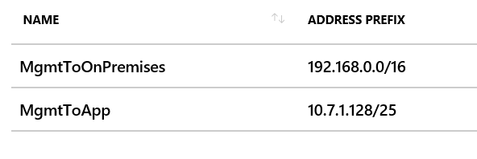
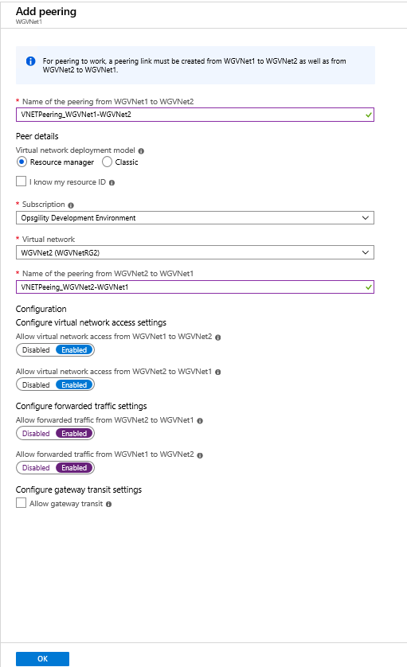
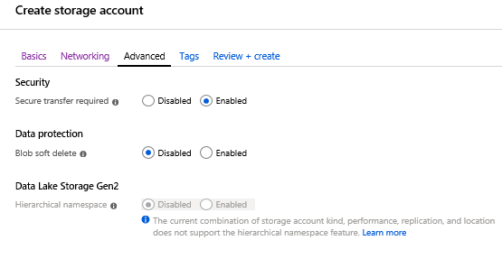



<div class="MCWHeader1">
Enterprise-class networking in Azure
</div>

<div class="MCWHeader2">
Hands-on lab step-by-step
</div>

<div class="MCWHeader3">
June 2019
</div>


Information in this document, including URL and other Internet Web site references, is subject to change without notice. Unless otherwise noted, the example companies, organizations, products, domain names, e-mail addresses, logos, people, places, and events depicted herein are fictitious, and no association with any real company, organization, product, domain name, e-mail address, logo, person, place or event is intended or should be inferred. Complying with all applicable copyright laws is the responsibility of the user. Without limiting the rights under copyright, no part of this document may be reproduced, stored in or introduced into a retrieval system, or transmitted in any form or by any means (electronic, mechanical, photocopying, recording, or otherwise), or for any purpose, without the express written permission of Microsoft Corporation.

Microsoft may have patents, patent applications, trademarks, copyrights, or other intellectual property rights covering subject matter in this document. Except as expressly provided in any written license agreement from Microsoft, the furnishing of this document does not give you any license to these patents, trademarks, copyrights, or other intellectual property.

The names of manufacturers, products, or URLs are provided for informational purposes only and Microsoft makes no representations and warranties, either expressed, implied, or statutory, regarding these manufacturers or the use of the products with any Microsoft technologies. The inclusion of a manufacturer or product does not imply endorsement of Microsoft of the manufacturer or product. Links may be provided to third party sites. Such sites are not under the control of Microsoft and Microsoft is not responsible for the contents of any linked site or any link contained in a linked site, or any changes or updates to such sites. Microsoft is not responsible for webcasting or any other form of transmission received from any linked site. Microsoft is providing these links to you only as a convenience, and the inclusion of any link does not imply endorsement of Microsoft of the site or the products contained therein.

© 2019 Microsoft Corporation. All rights reserved.

Microsoft and the trademarks listed at <https://www.microsoft.com/en-us/legal/intellectualproperty/Trademarks/Usage/General.aspx> are trademarks of the Microsoft group of companies. All other trademarks are property of their respective owners

**Contents**

<!-- TOC -->

- [Enterprise-class networking in Azure hands-on lab step-by-step](#enterprise-class-networking-in-azure-hands-on-lab-step-by-step)
    - [Abstract and learning objectives](#abstract-and-learning-objectives)
    - [Overview](#overview)
    - [Solution architecture](#solution-architecture)
    - [Requirements](#requirements)
    - [Help references](#help-references)
    - [Exercise 1: Create a Virtual Network and provision subnets](#exercise-1-create-a-virtual-network-and-provision-subnets)
        - [Task 1: Create a Virtual Network](#task-1-create-a-virtual-network)
        - [Task 2: Configure subnets](#task-2-configure-subnets)
    - [Exercise 2: Create second Virtual Network and provision subnets](#exercise-2-create-second-virtual-network-and-provision-subnets)
        - [Task 1: Create a second Virtual Network (hub)](#task-1-create-a-second-virtual-network-hub)
        - [Task 2: Configure App Subnet](#task-2-configure-app-subnet)
    - [Exercise 3: Create route tables with required routes](#exercise-3-create-route-tables-with-required-routes)
        - [Task 1: Create route tables](#task-1-create-route-tables)
        - [Task 2: Add routes to each route table](#task-2-add-routes-to-each-route-table)
    - [Exercise 4: Deploy n-tier application and validate functionality](#exercise-4-deploy-n-tier-application-and-validate-functionality)
        - [Task 1: Use the Azure portal for a template deployment](#task-1-use-the-azure-portal-for-a-template-deployment)
        - [Task 2: Validate the CloudShop application is up after the deployment](#task-2-validate-the-cloudshop-application-is-up-after-the-deployment)
        - [Task 3: Create a load balancer to distribute load between the web servers](#task-3-create-a-load-balancer-to-distribute-load-between-the-web-servers)
        - [Task 4: Configure the load balancer](#task-4-configure-the-load-balancer)
    - [Exercise 5: Build the management station](#exercise-5-build-the-management-station)
        - [Task 1: Build the management VM](#task-1-build-the-management-vm)
    - [Exercise 6: Virtual Network Peering](#exercise-6-virtual-network-peering)
        - [Task 1: Configure VNet peering WGVNet1 to WGVNet2](#task-1-configure-vnet-peering-wgvnet1-to-wgvnet2)
        - [Task 2: Configure VNet peering WGVNET2 to WGVNET1](#task-2-configure-vnet-peering-wgvnet2-to-wgvnet1)
    - [Exercise 7: Provision and configure Azure firewall solution](#exercise-7-provision-and-configure-azure-firewall-solution)
        - [Task 1: Provision the Azure firewall](#task-1-provision-the-azure-firewall)
        - [Task 2: Create Firewall Rules](#task-2-create-firewall-rules)
        - [Task 3: Associate route tables to subnets](#task-3-associate-route-tables-to-subnets)
        - [Task 4: Enable DDoS for virtual network](#task-4-enable-ddos-for-virtual-network)
    - [Exercise 8: Configure Site-to-Site connectivity](#exercise-8-configure-site-to-site-connectivity)
        - [Task 1: Create OnPrem Virtual Network](#task-1-create-onprem-virtual-network)
        - [Task 2: Configure gateway subnets for on premise Virtual Network](#task-2-configure-gateway-subnets-for-on-premise-virtual-network)
        - [Task 3: Create the first gateway](#task-3-create-the-first-gateway)
        - [Task 4: Create the second gateway](#task-4-create-the-second-gateway)
        - [Task 5: Connect the gateways](#task-5-connect-the-gateways)
    - [Exercise 9: Configure Network Security Groups and Application Security Groups](#exercise-9-configure-network-security-groups-and-application-security-groups)
        - [Task 1: Create application security groups](#task-1-create-application-security-groups)
        - [Task 2: Configure application security groups](#task-2-configure-application-security-groups)
        - [Task 3: Create network security group](#task-3-create-network-security-group)
    - [Exercise 10: Configure Service Endpoints](#exercise-10-configure-service-endpoints)
        - [Task 1: Create and configure a storage account](#task-1-create-and-configure-a-storage-account)
        - [Task 2: Configure Azure Storage firewall and add a service endpoint](#task-2-configure-azure-storage-firewall-and-add-a-service-endpoint)
    - [Exercise 11: Validate connectivity from 'on-premises' to Azure](#exercise-11-validate-connectivity-from-on-premises-to-azure)
        - [Task 1: Create a virtual machine to validate connectivity](#task-1-create-a-virtual-machine-to-validate-connectivity)
        - [Task 2: Configure routing for simulated 'on-premises' to Azure traffic](#task-2-configure-routing-for-simulated-on-premises-to-azure-traffic)
    - [After the hands-on lab](#after-the-hands-on-lab)

<!-- /TOC -->

# Enterprise-class networking in Azure hands-on lab step-by-step

## Abstract and learning objectives

In this hands-on lab, you will setup and configure virtual networks with subnets in Azure. You will also learn how to secure virtual networks by implementing Azure Firewall, service endpoints, network security groups and application security groups, as well as configure route tables on the subnets in your virtual network. Additionally, you will set up access to the virtual network via a jump box and provision a site-to-site VPN connection from another virtual network, providing emulation of hybrid connectivity from an on-premises environment.

At the end of this hands-on lab, you will be better able to configure Azure networking components. 


## Overview

You have been asked by Woodgrove Financial Services to provision a proof of concept deployment that will be used by the Woodgrove team to gain familiarity with a complex Virtual Networking deployment, including all of the components that enable the solution. Specifically, the Woodgrove team will be learning about:

-   How to bypass system routing to accomplish custom routing scenarios.

-   How to capitalize on load balancers to distribute load and ensure service availability.

-   How to implement Azure Firewall to control hybrid and cross-virtual network traffic flow based on policies.

-   How to implement a combination of Network Security Groups (NSGs) and Application Security Groups (ASGs) to control traffic flow within virtual networks.

-   How to leverage service endpoints to provide restricted access to Azure PaaS services.

The result of this proof of concept will be an environment resembling this diagram:

## Solution architecture


## Requirements

You must have a working Azure subscription to carry out this hands-on lab step-by-step.

## Help references

|    |            |
|----------|:-------------:|
| **Description** | **Links** |
| IP Addressing and Subnetting for New Users   | http://www.cisco.com/c/en/us/support/docs/ip/routing-information-protocol-rip/13788-3.html  |
| CIDR / VLSM Supernet Calculator  | <http://www.subnet-calculator.com/cidr.php>  |
| Virtual Network documentation  | <https://azure.microsoft.com/en-us/documentation/services/virtual-network/>  |
| Network Security Group documentation  | <https://azure.microsoft.com/en-us/documentation/articles/virtual-networks-nsg/>  |
| IP addresses in Azure      |  https://azure.microsoft.com/en-us/documentation/articles/virtual-network-ip-addresses-overview-arm/ |
| User-Defined Routing and IP Forwarding   | <https://azure.microsoft.com/en-us/documentation/articles/virtual-networks-udr-overview/>  |
| Load Balancer       | <https://azure.microsoft.com/en-us/documentation/articles/load-balancer-overview/>  |
| Implementing a DMZ between Azure and your on-premises data center    |  <https://azure.microsoft.com/en-us/documentation/articles/guidance-iaas-ra-secure-vnet-hybrid/>  |
| What is Azure Firewall?    |  <https://docs.microsoft.com/en-us/azure/firewall/overview/>  |
| Security groups    |  <https://docs.microsoft.com/en-us/azure/virtual-network/security-overview/>  |
| Virtual Network Service Endpoints |  <https://docs.microsoft.com/en-us/azure/virtual-network/virtual-network-service-endpoints-overview/>  |

## Exercise 1: Create a Virtual Network and provision subnets

Duration: 15 minutes

### Task 1: Create a Virtual Network

1.  From your **LABVM**, connect to the Azure portal, select **+ Create a resource**, and in the list of Marketplace categories, select **Networking** followed by selecting **Virtual Network**. 

1.  On the **Create virtual network** blade, enter the following information:

    -  Name: **WGVNet1**

    -  Address space: **10.7.0.0/24**

    -  Subscription: Choose your subscription.

    -  Resource group: Select **Create new**, and enter the name **WGVNetRG1**.

    -  Location: **(US) South Central US**

    -  Subnet name: **GatewaySubnet** (this name is fixed and cannot be changed)

    -  Subnet address range: **10.7.0.0/29**
 
1.  Leave the other options as default for now.

1.  Upon completion, it should look like the following screenshot. Validate the information is correct, and select **Create**.

    

1.  Monitor the deployment status by selecting **Notifications Bell** at the top of the portal. In a minute or so, you should see a confirmation of the successful deployment. Select **Go to Resource**.

### Task 2: Configure subnets

1.  Go to the WGVNetRG1 Group, and select **WGVNet1 Virtual Network** blade, and select **Subnets**.

    

1.  In the **Subnets** blade select **+Subnet**.

    

1.  On the **Add subnet** blade, enter the following information:

    -  Name: **Management**

    -  Address range: **10.7.0.8/29**

    -  Network security group: **None**

    -  Route table: **None**

    -  Service Endpoints: **Leave as Default**.

1.  When your dialog looks like the following screenshot, choose **OK** to create the subnet.

    

## Exercise 2: Create second Virtual Network and provision subnets

Duration: 15 minutes

### Task 1: Create a second Virtual Network (hub)

1.  From your **LABVM**, connect to the Azure portal, select **+ Create a resource**, and in the list of Marketplace categories, select **Networking** followed by selecting **Virtual Network**. 

1.  On the **Create virtual network** blade, enter the following information:

    -  Name: **WGVNet2**

    -  Address space: **10.7.1.0/24**

    -  Subscription: Choose your subscription.

    -  Resource group: Select **Create new**, and enter the name **WGVNetRG2**.

    -  Location: **(US) South Central US**

    -  Subnet name: **AzureFirewallSubnet** (this name is fixed and cannot be changed)

    -  Subnet address range: **10.7.1.0/26** (/26 is minimum requirement for azure firewall)

1.  Upon completion, it should look like the following screenshot. Validate the information is correct, and choose **Create**.

    

### Task 2: Configure App Subnet

1.  Go to the WGVNetRG2 Resource Group, and select **WGVNet2** blade, and select **Subnets**.

    

1.  In the **Subnets** blade, select **+Subnet**.

    

1.  On the **Add subnet** blade, enter the following information:

    -  Name: **AppSubnet**

    -  Address range: **10.7.1.128/25**

    -  Network security group: **None**

    -  Route table: **None**

1.  When your dialog looks like the following screenshot, select **OK** to create the subnet.

    

## Exercise 3: Create route tables with required routes

Duration: 15 minutes

Route Tables are containers for User Defined Routes (UDRs). The route table is created and associated with a subnet. UDRs allow you to direct traffic in ways other than normal system routes would. In this case, UDRs will direct outbound traffic via the Azure firewall.

### Task 1: Create route tables

1.  On the main portal menu, select **+ Create a Resource**. Type **route** into the search box, and choose **Route tables** then select **Create**.

1.  On the **Create a Route table** blade enter the following information:

    -  Name: **MgmtRT**

    -  Subscription: Choose your subscription.

    -  Resource group: Select **Use existing**, choose the drop-down menu, and select **WGVNetRG1**.

    -  Location: **(US) South Central US**

    -  Virtual network gateway route propagation: **Disabled**

1.  When the dialog looks like the following screenshot, select **Create**.
    
    

1.  Repeat steps 1 and 2 to create the **AppRT** route table:

    -  Name: **AppRT**

    -  Subscription: Choose your subscription.

    -  Resource group: Select **Use existing**, select the drop-down menu, and select **WGVNetRG2**.

    -  Location: **(US) South Central US**

    -  Virtual network gateway route propagation: **Disabled**

1.  Once route tables are created, your **Route tables** blade should look like the following screenshot:

    

### Task 2: Add routes to each route table

1.  Select on the **AppRT** route table, and choose **Routes**.

    

1.  On the **Routes** blade, choose +**Add**. Enter the following information, and select **OK**:

    -  Route name: **AppToInternet**

    -  Address prefix: **0.0.0.0/0**

    -  Next hop type: **Virtual appliance**

    -  Next hop address: **10.7.1.4**

    

1.  Repeat this procedure to add the **DataToMgmt** route using the following information:

    -  Route name: **AppToMgmt**

    -  Address prefix: **10.7.0.8/29**

    -  Next hop type: **Virtual appliance**

    -  Next hop address: **10.7.1.4**

    

1.  Upon completion, your routes in the **DataRT** route table should look like the following screenshot:

    

1.  In the Azure Portal, go to All Services and type Route in the search box and select **Route tables**

1.  Select **MgmtRT**, and choose **Routes**.

    

1.  On the **Routes** blade, choose +**Add**. Enter the following information, and choose **OK**:

    -  Route name: **MgmtToOnPremises**

    -  Address prefix: **192.168.0.0/16**

    -  Next hop type: **Virtual network gateway**

    -  Next hop address: **Leave it blank**.

    

1.  Add the **MgmtToApp** route using the following information:

    -  Route name: **MgmtToApp**

    -  Address prefix: **10.7.1.128/25**

    -  Next hop type: **Virtual appliance**

    -  Next hop address: **10.7.1.4** (this is the private IP of Azure Firewall)

    

1.  Upon completion, your routes in the **MgmtRT** route table should look like the following screenshot:

    

    >**Note:** The route tables and routes you have just created are not associated with any subnets yet, so they are not impacting any traffic flow yet. This will be accomplished later in the lab.

## Exercise 4: Deploy n-tier application and validate functionality

Duration: 90 minutes

In this task, you will provision the CloudShop application using an ARM template deployment. This application has a web tier and a data tier.

### Task 1: Use the Azure portal for a template deployment

> **Note:** If you have not downloaded the student files see this section in the before getting started section of this hands-on lab.

1.  On your LABVM, open the **C:\\ECN-Hackathon** which contains the student files for this lab.

1.  Make sure you are signed into the Azure portal at <http://portal.azure.com>.

1.  Choose **+ Create a resource**, and search for **template deployment**.

    

1.  On the Template deployment blade, choose Create.

1.  On the Custom deployment blade, select **Build your own template in the editor**.

    

1.  Choose **Load file** and select the **CloudShop.json** file from your **C:\\ECN-Hackathon** directory and then select **Save**.

    

1.  Update the following parameters to reference the **WGVNet2** virtual network in the **WGVNetRG2** resource group and to the **AppSubnet** subnet.

    

1.  Update the **Custom deployment** blade using the following inputs, agree to the terms, and choose **Purchase**. This deployment will take approximately 30-40 minutes.

    -  Resource Group: Create new / **WGVMRGTMT**

    -  Location: **(US) South Central US** (the same location you used to provision resources earlier in this lab)

    

### Task 2: Validate the CloudShop application is up after the deployment

1.  Using the Azure portal, open the **WGVMRG** Resource group and review the deployment.

1.  Navigate to the the **WGWEB1** blade.

1.  On the **WGWEB1** blade, first select **Connect** and then select **Download RDP file** to establish a Remote Desktop session.

    

1.  Depending on your Remote Desktop protocol client and browser configuration, you will either be prompted to open an RDP file, or you will need to download it and then open it separately to connect.

1.  Log in with the credentials specified during creation:

    -  User: **demouser**

    -  Password: **demo\@pass123**

1.  You will be presented with a Remote Desktop Connection warning because of a certificate trust issue. Select **Yes** to continue with the connection.

    

1.  When logging on for the first time, you will have a prompt asking about network discovery. Select **No**.

    

1.  Notice that Server Manager opens by default. Choose **Local Server**.

    

1.  In the details pane, ensure the **IE Enhanced Security Configuration** is set to **Off**. If that is not the case, select **On**. 

    

1.  If needed, change to **Off** for Administrators, and select **OK**.

    

1. You will now ensure the CloudShop application is up and running. Open Internet Explorer, and browse to both the WGWEB1 and WGWEB2 servers:

    ```
    http://wgweb1
    ```

    ```
    http://wgweb2
    ```

### Task 3: Create a load balancer to distribute load between the web servers

1.  In the Azure portal, choose **+ Create a resource**, then **Networking** and **Load Balancer**.

    

1.  On the **Create load balancer** blade, on the **Basics** tab, enter the following values:

    -  Subscription: Choose your subscription.

    -  Resource group: **Use existing** and select **WGVNETRG2**.

    -  Name: **WGWEBLB**

    -  Region: **(US) South Central US**

    -  Type: **Internal**

    -  SKU: **Basic**

    -  Virtual network: **WGVNet2**

    -  Subnet: **AppSubnet (10.7.1.128/25)**

    -  IP address assignment: Choose **Static** and enter the IP address **10.7.1.254**.

    Ensure your **Create load balancer** dialog looks like the following, and select **Review + create**.

    

### Task 4: Configure the load balancer

1.  Open the **WGWEBLB** load balancer in the Azure portal.

1.  Select **Backend pools**, and choose **+Add** at the beginning.

    

1.  Enter **LBBE** for the pool name. Under **Associated to**, choose **Availability set**.

    

1.  Next, select the **WebAVSet** Availability Set.

1.  Under **Target network IP configurations**, choose **+ Add a target network IP configuration**.

    

1.  Under **Target virtual machine**, choose **WGWEB1**.

    

1.  Under **Network IP configuration**, choose **WGWEB1NetworkInterface**

1.  Select **+ Add a target network IP configuration** repeating these steps, but this time, adding **WGWEB2** along with its IP configuration.

1.  Then, choose **Save**.

1.  Wait to proceed until the Backend pool configuration is finished updating.

    

1.  Next, under **Settings on the WGWEBLB Load Balancer blade** select **Health** **Probes**. Choose +**Add**, and use the following information to create a health probe.

    -  Name: **HTTP**

    -  Protocol: **HTTP**

    
    
    

1.  Choose **OK**.

1.  After the Health probe has updated. Select **Load balancing rules**. Choose +**Add** and complete the configuration as shown below followed by selecting **OK**.
    
    

    **It will take 2-3 minutes for the changes to save.**

1.  From an RDP session to WGWEB1, open your browser and point it at <http://10.7.1.254>. Ensure that you successfully connect to either one of two Web servers. 

    

    

1.  Using the portal, disassociate the public IP from the NIC of **WGWEB1** **VM**. Do this by selecting the Networking section below on the VM.

    

1.  Next, select the listed network interface **WGWEB1NetworkInterface** on the hyperlink.

1.  Next, choose the **IP configurations** section shown.

    

1.  Next, select the **ipconfig1** section on the NAME shown above.

1.  Next, select and make sure that the **Public IP address settings** is shown disabled below, and choose **Save**. This should remove the public IP address from the network interface of the VM.

    

## Exercise 5: Build the management station

Duration: 15 minutes

In this exercise, management of the Azure-based systems will only be available from a management 'jump box.' In this section, you will provision this server.

### Task 1: Build the management VM

1.  In the Azure portal, select **+ Create a resource**. In the **Search the Marketplace**, type **Windows Server 2016 Datacenter**, in the list of results, select **Windows Server**, in the expanded list of images, select **[smalldisk] Windows Server 2016 Datacenter**, and then select **Create**.

1.  On the **Create a virtual machine** blade, on the **Basics** tab, enter the following information, and select **Next : Disks >**:

    -  Subscription: Choose your subscription.

    -  Resource group: Choose **Create new** and enter **WGMGMTRG**.
      
    -  Virtual machine name: **WGMGMT1**

    -  Region: **(US) South Central US**

    -  Availability options: **No infrastructure redundancy required**

    -  Image: **[smalldisk] Windows Server 2016 Datacenter**

    -  Size: **Standard DS1 v2**

    -  User name: **demouser**

    -  Password: **demo\@pass123**

    -  Public inbound ports: **Allow selected ports**

    -  Select inbound ports: **RDP**

    -  Already have a Windows license?: **No**

1.  On the **Create a virtual machine** blade, on the **Disks** tab, set the following configuration and choose **Next : Networking >**:

    -  OS disk type: **Premium SSD**

1.  On the **Create a virtual machine** blade, on the **Networking** tab, set the following configuration and choose **Next : Management >**:

    -  Virtual network: **WGVNet1**

    -  Subnet: **Management (10.7.0.8/29)**

    -  Public IP: **None**
    
    -  NIC network security group: **None**

    -  Accelerated networking: **Off**

    -  Place this virtual machine behind an existing load balancing solution: **No**

1.  On the **Create a virtual machine** blade, on the **Management** tab, set the following configuration and choose **Review + create**:

    -  Boot diagnostics: **Off**

    -  OS guest diagnostics: **Off**

    -  System assigned managed identity: **Off**

    -  Enable auto-shutdown: **Off**

1.  On the **Create a virtual machine** blade, on the **Review + Create** tab, ensure the validation passes, and choose **Create**. The virtual machine will take about 5 minutes to provision.

## Exercise 6: Virtual Network Peering

Duration: 20 Minutes

### Task 1: Configure VNet peering WGVNet1 to WGVNet2

1.  Select the resource group **WGVNetRG1**, and select the configuration blade for **WGVNet1**. Choose **Peerings**.

1.  Select **Add**.

    

1.  Name the new peering **VNETPeering_WGVNet1-WGVNet2**, enable the **Allow forwarded traffic** and **Allow gateway transit** settings, and select **OK** to create the peering.

    

### Task 2: Configure VNet peering WGVNET2 to WGVNET1

1.  Select the resource group **WGVNetRG2**, and select the configuration blade for **WGVNet2**. Choose **Peerings**.

1.  Select **Add**.

1.  Name the new peering **VNETPeering_WGVNet2-WGVNet1**, enable the **Allow forwarded traffic** and **Use remote gateways** settings, and select **OK** to create the peering.

    
## Exercise 7: Provision and configure Azure firewall solution

Duration: 15 minutes

In this exercise, you will provision and configure an Azure firewall in your network. 

### Task 1: Provision the Azure firewall

1.  In the Azure portal, select **+ Create a resource**. In the **Search the Marketplace** text box, type **Azure firewall**, in the list of results, selct **Firewall**, and on the **Firewall** blade, click **Create**.

1.  On the **Create a firewall** blade, on the **Basics** tab, enter the following information: 
   
    -  Subscription: Choose your subscription.

    -  Resource group: **WGVNetRG2**
      
    -  Name: **azureFirewall**

    -  Region: **(US) South Central US**

    -  Choose a Virtual network: select **Use existing** and then select **WGVNet2**

    -  Public IP address: **Create new**

    -  Public IP address name: **azureFirewall-ip**
    
    -  Public IP address SKU: **Standard**

1.  Select **Review + create** and then select **Create** to provision the Azure Firewall. 
   
    

### Task 2: Create Firewall Rules

Within 1-2 minutes, the resource group **WGVNetRG2** will have the firewall created. Next, we will firewall rules to allow the inbound and outbound traffic.

1.  On the main Azure menu select **Resource groups**.

1.  Select the **WGVNetRG2** resource group. This resource group contains the azure firewall and its public IP address resources.

1.  Navigate to the **azureFirewall-ip** blade and note the value of its public IP address. You will need it later in this task.

1.  Navigate to the **azureFirewall** blade, and, on the **Overview** page, select **Rules**.

    

1.  Select **+ Add NAT Rule collection** and enter the following information to create an inbound NAT Rule (collection is a list of rules that share the same priority and action):
   
    -  Name: **NATRuleCollection1**

    -  Priority: **250**

    -  Rules Name: **IncomingHTTP**

    -  Protocol: **TCP**

    -  Source address: *****

    -  Destination Address: type the public IP address assigned to the firewall you identified earlier in this task

    -  Destination ports: **80** (to allow HTTP traffic)

    -  Translated Address: **10.7.1.254** (private IP of the Azure Load Balancer you deployed earlier in this lab)
        
    -  Translated Port: **80**

1.  Repeat the above process and create another rule for HTTPS, as illustrated on the following screenshot (alternatively you could create a single rule for both HTTP and HTTPS).

    

1.  Select **Add** and wait until the update completes.

1.  Back on the Azure Firewall **Rules** page, select **Network rule collection**. Then Select **+ Add Network Rule collection** and enter the following information to create a Network Rule for inbound traffic. This rule allows HTTP connectivity from any directly connected network targeting the frontend IP address of the load balancer.

    -  Name: **NetworkRuleCollectionAllow1**

    -  Priority: **100**

    -  Action: **Allow**

    -  Rule Name: **IncomingWeb**

    -  Protocol: **TCP**

    -  Source address: *****

    -  Destination Address: **10.7.1.254**

    -  Destination ports: **80,443**

1.  Crate another rule for Remote Desktop sessions from the Management subnet on WGVnet1.

    -  Rule Name: **IncomingMgmtRDP**

    -  Protocol: **TCP**

    -  Source address: **10.7.0.8/29**

    -  Destination Address: **10.7.1.128/25**

    -  Destination ports: **3389**

    

1.  Select **Add** and wait until the update completes.


### Task 3: Associate route tables to subnets

1.  In the Azure portal, navigate to the blade displaying properties of the **WGVNetRG2** resource group.

1.  Select **AppRT**, followed by **Subnets** and then select **+ Associate**.

    

1.  On the **Associate subnet** blade, select **Virtual network**. Then, choose on **WGVNet2**.

    

1.  From the **Choose a subnet** blade, choose **AppSubnet**.

    

1.  Select **OK** at the bottom of the **Associate subnet** blade.

1.  Navigate to the blade displaying properties of the **WGVNetRG1** resource group, and select **MgmtRT**, then **Subnets**.

1.  Select the **+Associate**.

1.  On the **Associate subnet** blade, select **Virtual network**. Choose **WGVNet1**.

    

1.  The **Choose subnet** blade opens. Choose **Management**.

    

1.  Select **OK** at the bottom of the **Associate subnet** blade.

### Task 4: Enable DDoS for virtual network

In this task you will enable DDoS services for your virtual network.

1.  In the Azure Portal, select **+ Create a resource** and in the **Search the Marketplace** box type **DDoS Protection Plan**, and, on the **DDoS Protection Plan** blade, select **Create**.

1.  On the **Create a DDoS protection plan** blade, enter the following information:
        
    -  Name: **DDoSprotection**

    -  Subscription: Choose your subscription.

    -  Resource group: **WGVNetRG2**

    -  Location: **(US) South Central US**

    

1.  Once completed, select **Create** to create a DDoS protection plan. Wait few minutes to complete the provisioning.

1.  In the Azure portal, navigate to the blade of the virtual network **WGVNet**, select **DDoS protection**, select **Standard**, and, in the **DDoS protection plan** drop-down list, select the **DDoSprotection** entry. 

    

1.  Once completed click **Save**


## Exercise 8: Configure Site-to-Site connectivity

Duration: 60 minutes

In this exercise, we will simulate an on-premises connection to the internal web application. To do this, we will first set up another Virtual Network in a separate Azure region followed by the Site-to-Site connection of the 2 Virtual Networks Finally, we will set up a virtual machine in the new Virtual Network to simulate on-premises connectivity to the internal load-balancer.

### Task 1: Create OnPrem Virtual Network

1.  In the Azure portal, choose **+ Create a resource**, **Networking** and **Virtual network**.

1.  On the **Create virtual network** blade, enter the following information:

    -  Name: **OnPremVNet**
    
    -  Address space: **192.168.0.0/16**
    
    -  Subscription: Choose your subscription
    
    -  Resource group: Select **Create new**, and enter the name **OnPremVNetRG**

    -  Location: **(US) East US** (make sure this is **NOT** the same location you have specified in the previous exercises)

    -  Subnet name: **default**

    -  Subnet address range: **192.168.0.0/24**
 
1.  Leave the other options with their default.

1.  Upon completion, it should look like the following screenshot. Validate the information is correct, and select **Create**.

     |  |


### Task 2: Configure gateway subnets for on premise Virtual Network

1.  Select the **OnPremVnetRG** Resource Group and then open the **OnPremVNet** blade and choose **Subnets**.

1.  Next, choose **+ Gateway subnet**.

    

1.  Specify the following configuration for the subnet, and select **OK**:

    -  Address range: **192.168.1.0/29**

    -  Route table: **None** (We will add later.)

    

4.  Next, add **OnPremManagementSubnet** to the **OnPremVNet**, as shown below in the screenshot:

    

### Task 3: Create the first gateway

1.  Using the Azure Management portal, choose **+ Create a resource**, type **Virtual Network gateway** in the **Search the Marketplace** text box, in the list of results, select **Virtual network gateway**, and then select **Create**.

1.  On the **Create virtual network gateway** blade,  enter the following information and select **Review + create**:

    -  Subscription: Choose your subscription
    
    -  Name: **OnPremWGGateway**

    -  Resource group: **OnPremVNetRG**

    -  Location: **(US) East US** (this must match the location in which you created the **OnPremVNet** virtual network)

    -  Gateway type: **VPN**

    -  VPN type: **Route-based**

    -  SKU: **VpnGw1**

    -  Virtual network: **OnPremVNet**

    -  Public IP address: **Create new**

    -  Public IP address name: **onpremgatewayIP**

    -  Enable active-active mode: **Disabled**

    -  Configure BGP ASN: **Disabled**

    

1.  Validate your settings and select **Create**.

    >**Note:** The gateway will take 30-45 minutes to provision. Rather than waiting, continue to the next section.

### Task 4: Create the second gateway

1.  Using the Azure Management portal, choose **+ Create a resource**, type **Virtual Network gateway** in the **Search the Marketplace** text box, in the list of results, select **Virtual network gateway**, and then select **Create**.

1.  On the **Create virtual network gateway** blade,  enter the following information and select **Review + create**:

    -  Subscription: Choose your subscription
    
    -  Name: **WGVNet1Gateway**

    -  Resource group: **OnPremVNetRG**

    -  Location: **(US) South Central US** (this must match the location in which you created the **WGVNet1** virtual network)

    -  Gateway type: **VPN**

    -  VPN type: **Route-based**

    -  SKU: **VpnGw1**

    -  Virtual network: **WGVNet1**

    -  Public IP address: **Create new**

    -  Public IP address name: **vnet1gatewayIP**

    -  Enable active-active mode: **Disabled**

    -  Configure BGP ASN: **Disabled**

    

1.  Validate your settings and select **Create**.

    >**Note:** The gateway will take 30-45 minutes to provision. You will need to wait until both gateways are provisioned before proceeding to the next section.

1.  The Azure portal will display a notification when the deployments have completed.

### Task 5: Connect the gateways

1.  In the Azure portal, click **+ Create a resource**, in the **Search the Marketplace** text box, type in **Connection**, and press **Enter**.

1.  On the **Connection** blade, choose **Create**.

1.  On the **Basics** blade, leave the **Connection type** set to **VNet-to-VNet**. Select the existing **WGVNetRG1** resource group. Then, change the location of this connection to the Azure region hosting the **WGVNet1** virtual network. Select **OK**.

    

1.  On the Settings tab, select **WGVNet1Gateway** as the first virtual network gateway and **OnPremWGGateway** as the second virtual network gateway. Ensure **Establish bidirectional connectivity** is selected. Enter a shared key, such as **A1B2C3D4**, for example. Select **OK**.

    

1.  Choose **OK** on the **Summary** page to create the connection.

1.  In the Azure portal, choose **All services**. Then, type **connections** in the search text box and select **Connections**.

    

1.  Watch the progress of the connection status, and use the **Refresh** icon until the status changes for both connections from **Unknown** to **Connected**. This may take 5-10 minutes or more. You might need to refresh the page to see the change in status.

    


## Exercise 9: Configure Network Security Groups and Application Security Groups

Duration: 20 minutes

In this exercise, you will restrict traffic between tiers of n-tier application by using network security groups and application security groups.

### Task 1: Create application security groups

1.  In the Azure portal, select **+ Create a resource**. In the **Search the Marketplace**, type **Application security group** and press Enter. Next, on the **Application security group** blade, select **Create**.

1.  On the **Create an application security group** blade, on the **Basics** tab, enter the following information, and select **Review + create**:

    -  Subscription: Choose your subscription
    
    -  Resource group: **WGVNetRG2**

    -  Name: **WebTier**

    -  Region: **(US) South Central US** (this must match the location in which you created the **WGVNet2** virtual network)

    

1.  On the **Create an application security group** blade, on the **Review + Create** tab, ensure the validation passes, and choose **Create**. 

1.  Repeat the previous two steps to create an application security group named **DataTier** with the settings matching those on the following screenshot.

    

### Task 2: Configure application security groups

1.  In the Azure portal, navigate to the **Virtual machines** blade and select **WGWEB1**. 

1.  On the **WGWEB1** blade, select **Networking**. 

1.  On the **WGWEB1 - Networking ** blade, select **Application security groups** and then select **Configure the application security groups**.

1.  On the **Configure the application security groups** blade, in the **Application security groups** drop-down list, select **WebTier** and then select **Save**.

    

1.  Repeat steps 1-4, but this time for **WGWEB2** in order to assign to its network interface the **WebTier** application security group.

1.  Repeat steps 1-4, but this time for **WGSQL1** in order to assign to its network interface the **DataTier** application security group.

### Task 3: Create network security group

1.  In the Azure portal, select **+ Create a resource**. In the **Search the Marketplace**, type **Network security group** and press Enter. Next, on the **Network security group** blade, select **Create**.

1.  On the **Create network security group** blade, enter the following information, and select **Create**:

    -  Name: **WGAppNSG1**

    -  Subscription: Choose your subscription
    
    -  Resource group: **WGVNetRG2**

    -  Region: **(US) South Central US** (this must match the location in which you created the **WGVNet2** virtual network)

    

1.  In the Azure Portal, navigate to **All Services**, type **Network secuirity groups** the search box and select **Network security groups**

1.  On the **Network security groups** blade, select **WGAppNSG1**. 

1.  On the **WGAppNSG1** blade, click **Inbound security rules** and select **Add**.

1.  On the **Add inbound security rule** blade, enter the following information, and select **Add**:

    -  Source: **Application security group**

    -  Source application security group: **WebTier**

    -  Source port ranges: **\***

    -  Destination: **Application security group**

    -  Destination application security group: **DataTier**

    -  Destination port ranges: **1433**

    -  Protocol: **TCP**

    -  Action: **Allow**

    -  Priority: **100**

    -  Name: **AllowDataTierInboundTCP1433**

    

1.  On the **WGAppNSG1 - Inbound security rules** blade, select **Add**.

1.  On the **Add inbound security rule** blade, enter the following information, and select **Add**:

    -  Source: **Any**

    -  Source port ranges: **\***

    -  Destination: **Application security group**

    -  Destination application security group: **WebTier**

    -  Destination port ranges: **80**

    -  Protocol: **TCP**

    -  Action: **Allow**

    -  Priority: **150**

    -  Name: **AllowAnyWebTierInboundTCP80**

    

1.  On the **WGAppNSG1 - Inbound security rules** blade, select **Add**.

1.  On the **Add inbound security rule** blade, enter the following information, and select **Add**:

    -  Source: **IP Addresses**

    -  Source IP addresses/CIDR ranges: **10.7.0.8/29** (this IP address range represents the Management subnet on WGVNet1)

    -  Source port ranges: **\***

    -  Destination: **Any**

    -  Destination port ranges: **3389**

    -  Protocol: **Any**

    -  Action: **Allow**

    -  Priority: **200**

    -  Name: **AllowMgmtInboundAny3389**

    

1.  On the **WGAppNSG1 - Inbound security rules** blade, select **Add**.

1.  On the **Add inbound security rule** blade, enter the following information, and select **Add**:

    -  Source: **Service Tag**

    -  Source service tag: **VirtualNetwork**

    -  Source port ranges: **\***

    -  Destination: **Application security group**

    -  Destination application security group: **DataTier**

    -  Destination port ranges: **\***

    -  Protocol: **Any**

    -  Action: **Deny**

    -  Priority: **1000**

    -  Name: **DenyVNetDataTierInbound**

    

1.  On the **WGAppNSG1 - Inbound security rules** blade, select **Add**.

1.  On the **Add inbound security rule** blade, enter the following information, and select **Add**:

    -  Source: **Service Tag**

    -  Source service tag: **VirtualNetwork**

    -  Source port ranges: **\***

    -  Destination: **Application security group**

    -  Destination application security group: **WebTier**

    -  Destination port ranges: **\***

    -  Protocol: **Any**

    -  Action: **Deny**

    -  Priority: **1050**

    -  Name: **DenyVNetWebTierInbound**

    

1.  On the **WGAppNSG1 - Inbound security rules** blade, select **Subnets** and then select **+ Associate**

1.  On the **Associate subnet** blade, select **Virtual network**. Then, choose on **WGVNet2**.

1.  On the **Choose a subnet** blade, choose **AppSubnet**.

1.  Select **OK** at the bottom of the **Associate subnet** blade.


## Exercise 10: Configure Service Endpoints

In this exercise, you will configure service endpoints to restrict access to Azure Storage.

Duration: 20 minutes

### Task 1: Create and configure a storage account

1.  In the Azure portal, select **+ Create a resource**, next select **Storage** and then select **Storage account**. 

1.  On the **Create storage account** blade, on the **Basics** tab, enter the following information, and select **Next : Advanced >**:

    -  Subscription: Choose your subscription.

    -  Resource group: **WGMGMTRG**.
      
    -  Storage account name: any unique name consisting of lower case letters and digits of length between 3 and 24 characters

    -  Region: **(US) South Central US**  (this must match the location in which you created the **WGVNet1** and **WGVNet2** virtual networks)

    -  Performance: **Standard**

    -  Account kind: **Storage (general purpose v1)**

    -  Replication: **Locally-redundant storage (LRS)**

    

1.  On the **Create storage account** blade, on the **Advanced** tab, set the following configuration and choose **Review + create**:

    -  Secure transfer required: **Enabled**

    -  Allow access from: **Selected network**

    -  Virtual network: **WGVNet1**

    -  Subnets: **Management (10.7.0.8/29) ('Microsoft.Storage' endpoint will be added)

    -  Blob soft delete: **Disabled**

    -  Hierarchical namespace: **Disabled**

    

1.  On the **Create storage account** blade, on the **Review + Create** tab, ensure the validation passes, and choose **Create**. 

### Task 2: Configure Azure Storage firewall and add a service endpoint

1.  In the Azure portal, navigate to the blade of the newly created storage account and select **Firewalls and virtual networks**.

    

1.  Select **+ Add existing virtual network**.

1.  On the **Add networks** blade, enter the following information:

    -  Subscription: Choose your subscription

    -  Virtual networks: **WGVNet2**

    -  Subnet: **AppSubnet (Service endpoint required)**

    

1.  Select **Enable** and then select **Add**.

1.  Back on the **Firewalls and virtual networks** blade of the storage account, select **Save**. Expand the entries in the **VIRTUAL NETWORK** column to ensure that the endpoints are enabled.

    


## Exercise 11: Validate connectivity from 'on-premises' to Azure

Duration: 30 minutes

In this exercise, you will validate connectivity from your simulated on-premises environment to Azure.

### Task 1: Create a virtual machine to validate connectivity

1.  Create a new virtual machine in the OnPremVnet virtual network. In the Azure portal, select **+ Create a resource** . In the **Search the Marketplace**, type **Windows Server 2016 Datacenter**, in the list of results, select **Windows Server**, in the expanded list of images, select **[smalldisk] Windows Server 2016 Datacenter**, and then select **Create**.

1.  On the **Create a virtual machine** blade, on the **Basics** tab, enter the following information, and select **Next : Disks >**:

    -  Subscription: Choose your subscription.

    -  Resource group: Choose **Create new** and enter **OnPremVMRG**.
      
    -  Virtual machine name: **OnPremVM**

    -  Region: **(US) East US** (this must much the region you created the OnPremVNet virtual network)

    -  Availability options: **No infrastructure redundancy required**

    -  Image: **[smalldisk] Windows Server 2016 Datacenter**

    -  Size: **Standard DS1 v2**

    -  User name: **demouser**

    -  Password: **demo\@pass123**

    -  Public inbound ports: **Allow selected ports**

    -  Select inbound ports: **RDP**

    -  Already have a Windows license?: **No**

1.  On the **Create a virtual machine** blade, on the **Disks** tab, set the following configuration and choose **Next : Networking >**:

    -  OS disk type: **Premium SSD**

1.  On the **Create a virtual machine** blade, on the **Networking** tab, set the following configuration and choose **Next : Management >**:

    -  Virtual network: **OnPremVNet**

    -  Subnet: **OnPremManagementSubnet (192.168.2.0/29)**

    -  Public IP: **(new)OnPremVM-ip**
    
    -  NIC network security group: **Basic**

    -  Public inbound ports: **Allow selected ports**

    -  Select inbound ports: **RDP**

    -  Accelerated networking: **Off**

    -  Place this virtual machine behind an existing load balancing solution: **No**

1.  On the **Create a virtual machine** blade, on the **Management** tab, set the following configuration and choose **Review + create**:

    -  Boot diagnostics: **Off**

    -  OS guest diagnostics: **Off**

    -  System assigned managed identity: **Off**

    -  Enable auto-shutdown: **Off**

1.  On the **Create a virtual machine** blade, on the **Review + Create** tab, ensure the validation passes, and choose **Create**. The virtual machine will take about 5 minutes to provision.

### Task 2: Configure routing for simulated 'on-premises' to Azure traffic

When packets arrive from the simulated 'on-premises' Virtual Network (OnPremVNet) to the 'Azure-side' (WGVNet1), they arrive at the gateway WGVNet1Gateway. This gateway is in a gateway subnet (10.7.0.0/29). For packets to be directed to the Azure firewall, we need another route table and route to be associated with the gateway subnet on the 'Azure-side'.

1.  On the Azure portal, in the hub menu, choose **All services** at the bottom. Enter **Route** in the search box, and select **Route tables**.

1.  On the **Route tables** blade, select **Add**.

1.  On the **Route table** blade, enter the following information:

    -  Name: **WGAzureVNetGWRT**

    -  Subscription: Choose your subscription.

    -  Resource group: Select **Use existing**, choose the drop-down menu, and select **WGVNetRG1**.

    -  Location: **(US) South Central US** (this must match the location in which you created the **WGVNet1** virtual network)

    -  Virtual network gateway route propagation: **Disabled**

    

1.  Choose **Create**.

1.  Choose **WGAzureVNetGWRT** route table.

    

1.  Select **Routes**.

1.  On the **Routes** blade, select the **+Add** button. Enter the following information, and choose **OK**:

    -  Route name: **OnPremToAppSubnet**

    -  Address prefix: **10.7.1.128/25**

    -  Next hop type: **Virtual appliance**

    -  Next hop address: **10.7.1.4**

    

1.  On the **WGAzureVNetGWRT - Routes** blade, select **Subnets**.

1.  On the **Subnets** blade, select **Associate**.

1.  On the **Associate subnet** blade, select **Virtual Network**. Then, choose on **WGVNet1**.

    

1.  The **Choose subnet** blade opens. Select **Gateway Subnet**. Then, choose **OK** to complete the association.

    

    >**Note:** At this point, you have configured your enterprise network. You should be able to test your Enterprise Class Network from one region to another. Your testing can include the following scenarios:

    -  On your lab VM, open Internet Explorer and browse to the web application deployed to the WGVnet2 via the public IP address of the Azure Firewall (20.45.4.50). Note that this IP address can be also be reached by any of the Azure virtual machines provisioned in this lab.

    -  On the 'on-premises' virtual machine (OnPremVM), attempt to initiate a Remote Desktop session to any virtual machine on the AppSubnet (10.7.1.128/25). Note that this should fail since it is blocked by Azure Firewall.

    -  On the 'on-premises' virtual machine (OnPremVM), open Internet Explorer and browse to the web application deployed to the WGVnet2 via the private IP address of the Azure Load Balancer (10.7.1.254). Note that this traffic is routed (and allowed) via Azure Firewall.

    -  On the jump host virtual machine (WGMGMT1), open Internet Explorer and browse to the web application deployed to the WGVnet2 via the private IP address of the Azure Load Balancer(10.7.1.254). Note that this traffic is not routed via Azure Firewall.

    -  On the jump host virtual machine (WGMGMT1), initiate a Remote Desktop session to the WGWEB1 via its private IP address (10.7.1.132). This should be successful since it is allowed by Azure Firewall. However, an attempt to connect via Remote Desktop to the WGSQL1 via its private IP address shoudl fail since it is blocked by a network security group.

    -  On the jump host virtual machine (WGMGMT1), initiate a Remote Desktop session to the WGWEB2 via its private IP address (10.7.1.133). This should be successful since it is allowed by Azure Firewall. However, an attempt to connect via Remote Desktop to the WGSQL1 via its private IP address shoudl fail since it is blocked by a network security group.

    -  On the jump host virtual machine (WGMGMT1), initiate a Remote Desktop session to the WGSQL1 via its private IP address (10.7.1.134). This should be successful since it is allowed by Azure Firewall.

    -  Create a file share in the storage account created in exercise 10 and map a drive to it from both the jump host virtual machine (WGMGMT1) and one of the virtual machines on the WGVNet2 virtual network (WGWEB1, WGWEB2, or WGSQL1). This should be successful since it is allowed by Service Endpoints. Next, attempt mapping a drive from the 'on-premises' virtual machine (OnPremVM). This should fail since the direct route associated with Service Endpoint does not apply to this virtual machine. 

    >**Note:** You will need to create the file share from the jump host virtual machine (WGMGMT1), not from your lab virtual machine due to the Azure Storage firewall settings you configured in exercise 10.

## After the hands-on lab

Duration: 10 minutes

After you have successfully completed the Enterprise-class networking in Azure hands-on lab step-by-step, you will want to delete the Resource Groups. This will free up your subscription from future charges.

